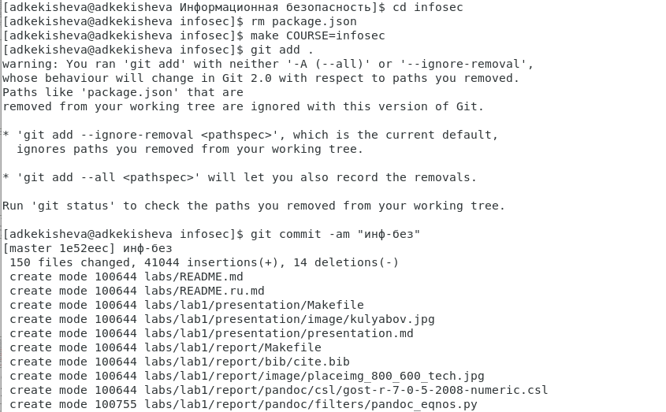

---
## Front matter
lang: ru-RU
title: Лабораторная работа №1 и №2
subtitle: Установка и конфигурация операционной системы на виртуальную машину и управление версиями
author:
  - Кекишева А.Д.
institute:
  - Российский университет дружбы народов, Москва, Россия
date: 09 сентябрь 2023

## i18n babel
babel-lang: russian
babel-otherlangs: english

## Formatting pdf
toc: false
toc-title: Содержание
slide_level: 2
aspectratio: 169
section-titles: true
theme: metropolis
header-includes:
 - \metroset{progressbar=frametitle,sectionpage=progressbar,numbering=fraction}
 - '\makeatletter'
 - '\beamer@ignorenonframefalse'
 - '\makeatother'
---

# Информация

## Докладчик

:::::::::::::: {.columns align=center}
::: {.column width="70%"}

  * Кекишева Анастасия Дмитриевна
  * Бизнес-информатика
  * Кафедра теории веротности и кибербезопасности
  * Российский университет дружбы народов
  * 1032201194@pfur.ru
  * <https://github.com/adkekisheva>

:::
::: {.column width="30%"}

:::
::::::::::::::

# Цель работы

- Приобретение практических навыков установки операционной системы на виртуальную машину, настройки минимально необходимых для дальнейшей работы сервисов.
- Изучение идеологии и применение средств контроля версий.

# Задание к 1-ой лабораторной:

Получить следующую информацию:
- Версия ядра Linux (Linux version).
- Частота процессора (Detected Mhz processor).
- Модель процессора (CPU0).
- Объем доступной оперативной памяти (Memory available).
- Тип обнаруженного гипервизора (Hypervisor detected).
- Тип файловой системы корневого раздела.

# Задание к 2-ой лабораторной:

- Создать базовую конфигурацию для работы с git.
- Создать ключ SSH .
- Создать ключ PGP .
- Настроить подписи git.
- Зарегистрироваться на Github .
- Создать локальный каталог для выполнения заданий по предмету.

# Выполнение лабораторной работы №1 - Шаг 1
Создала новую виртуальную машину, указала имя виртуальной машины -- adkekisheva. Выбрала тип операционной системы — Linux, RedHat.
{#fig:001 width=70%}

# Шаг 2
Указала размер основной памяти виртуальной машины — 2048 МБ.
{#fig:002 width=70%}

# Шаг 3.1
{#fig:003 width=70%}

# Шаг 3.2
{#fig:004 width=70%}

# Шаг 3.3
{#fig:005 width=70%}

# Шаг 4
Задала размер диска — 40 ГБ и его расположение.
{#fig:006 width=70%}

# Шаг 5
Добавила новый привод оптических дисков и выбрала образ операционной системы.
{#fig:007 width=70%}

# Шаг 6
Запустила виртуальную машину, скорректировала часовой пояс, раскладку клавиатуры.
{#fig:008 width=70%}

# Шаг 7
Отключила KDUMP.
{#fig:009 width=70%}

# Шаг 8
Указала в качестве базового окружения Server with GUI , а в качестве дополнения — Development Tools.
{#fig:010 width=70%}

# Шаг 9
Включила сетевое соединение и в качестве имени узла указала adkekisheva.localdomain (рис. @fig:0011).
{#fig:011 width=70%}

# Шаг 10
Установила пароль для root.
{#fig:012 width=70%}

# Шаг 11
Установила пользователя с правами администратора.
{#fig:013 width=70%}

# Шаг 12
{#fig:014 width=70%}

# Шаг 13
Вошла в ОС под заданной учётной записью и установила драйверы.
{#fig:015 width=70%}

# Шаг 14
Выполнила команду dmesg в консоли.
{#fig:016 width=70%}

# Шаг 15
Последовательности загрузки:
- загрузка и инициализация ядра; 
- обнаружение и конфигурирование устройств; 
- создание процессов ядра; 
- выполнение сценариев запуска; 
- работа в многопользовательском режиме. 

# Шаг 16 - получение информации командой grep -i
{#fig:017 width=70%}

# Шаг 16 - - получение информации командой grep -i
{#fig:018 width=70%}

# Шаг 17
{#fig:019 width=70%}

# Шаг 18
{#fig:020 width=70%}

# Выполнение лабораторной работы №2 - Шаг 1
{#fig:021 width=70%}

# Шаг 2
{#fig:022 width=70%}

# Шаг 3
{#fig:023 width=70%}

# Шаг 4 
{#fig:024 width=70%}

# Шаг 5
Просмотрела созданный ключ SSH размером 4096 бит.
{#fig:025 width=70%}

# Шаг 6
{#fig:026 width=70%}

# Шаг 7
{#fig:027 width=70%}
 

# Шаг 8
{#fig:028 width=70%}
 

# Шаг 9
{#fig:029 width=70%}

# Шаг 10
{#fig:030 width=70%}

# Шаг 11
{#fig:031 width=70%}

# Шаг 12
{#fig:032 width=70%}

# Выводы

- Приобрела практических навыки установки операционной системы на виртуальную машину, настройки минимально необходимых для дальнейшей работы сервисов.
- Поработала с git, вспомнила работу с ним, установила програмное обеспечение.
:::

