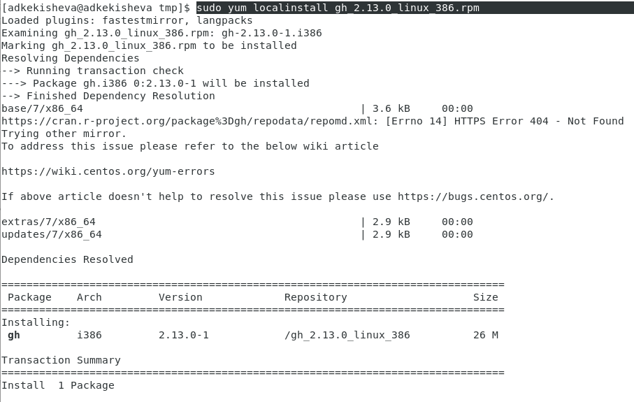

---
## Front matter
title: "Лабораторная работа №1 и №2"
subtitle: "Установка и конфигурация операционной системы на виртуальную машину и управление версиями"
author: "Кекишева Анасатасия Дмитриевна"

## Generic otions
lang: ru-RU
toc-title: "Содержание"

## Bibliography
bibliography: bib/cite.bib
csl: pandoc/csl/gost-r-7-0-5-2008-numeric.csl

## Pdf output format
toc: true # Table of contents
toc-depth: 2
lof: true # List of figures
lot: true # List of tables
fontsize: 12pt
linestretch: 1.5
papersize: a4
documentclass: scrreprt
## I18n polyglossia
polyglossia-lang:
  name: russian
  options:
	- spelling=modern
	- babelshorthands=true
polyglossia-otherlangs:
  name: english
## I18n babel
babel-lang: russian
babel-otherlangs: english
## Fonts
mainfont: PT Serif
romanfont: PT Serif
sansfont: PT Sans
monofont: PT Mono
mainfontoptions: Ligatures=TeX
romanfontoptions: Ligatures=TeX
sansfontoptions: Ligatures=TeX,Scale=MatchLowercase
monofontoptions: Scale=MatchLowercase,Scale=0.9
## Biblatex
biblatex: true
biblio-style: "gost-numeric"
biblatexoptions:
  - parentracker=true
  - backend=biber
  - hyperref=auto
  - language=auto
  - autolang=other*
  - citestyle=gost-numeric
## Pandoc-crossref LaTeX customization
figureTitle: "Рис."
tableTitle: "Таблица"
listingTitle: "Листинг"
lofTitle: "Список иллюстраций"
lotTitle: "Список таблиц"
lolTitle: "Листинги"
## Misc options
indent: true
header-includes:
  - \usepackage{indentfirst}
  - \usepackage{float} # keep figures where there are in the text
  - \floatplacement{figure}{H} # keep figures where there are in the text
---

# Цель работы

- Приобретение практических навыков установки операционной системы на виртуальную машину, настройки минимально необходимых для дальнейшей работы сервисов.
- Изучение идеологии и применение средств контроля версий.
- Освоение работы с git.

# Задание

Для лабораторной №1:

Получить следующую информацию:
- Версия ядра Linux (Linux version).
- Частота процессора (Detected Mhz processor).
- Модель процессора (CPU0).
- Объем доступной оперативной памяти (Memory available).
- Тип обнаруженного гипервизора (Hypervisor detected).
- Тип файловой системы корневого раздела.

Для лабораторной №2: 

- Создать базовую конфигурацию для работы с git.
- Создать ключ SSH .
- Создать ключ PGP .
- Настроить подписи git.
- Зарегистрироваться на Github .
- Создать локальный каталог для выполнения заданий по предмету.

# Теоретическое введение

Опишем теоретические аспекты, связанные с выполнением работы.

Системы контроля версий (Version Control System, VCS) применяются при работе несколь-
ких человек над одним проектом. Обычно основное дерево проекта хранится в локальном
или удалённом репозитории, к которому настроен доступ для участников проекта. При
внесении изменений в содержание проекта система контроля версий позволяет их
фиксировать, совмещать изменения, произведённые разными участниками проекта,
производить откат к любой более ранней версии проекта, если это требуется.

В классических системах контроля версий используется централизованная модель,
предполагающая наличие единого репозитория для хранения файлов. Выполнение боль-
шинства функций по управлению версиями осуществляется специальным сервером.
Участник проекта (пользователь) перед началом работы посредством определённых
команд получает нужную ему версию файлов. После внесения изменений, пользователь
размещает новую версию в хранилище. При этом предыдущие версии не удаляются
из центрального хранилища и к ним можно вернуться в любой момент. Сервер может
сохранять не полную версию изменённых файлов, а производить так называемую дельта-
компрессию — сохранять только изменения между последовательными версиями, что
позволяет уменьшить объём хранимых данных.
Системы контроля версий поддерживают возможность отслеживания и разрешения
конфликтов, которые могут возникнуть при работе нескольких человек над одним
файлом. Можно объединить (слить) изменения, сделанные разными участниками (авто-
матически или вручную), вручную выбрать нужную версию, отменить изменения вовсе
или заблокировать файлы для изменения. В зависимости от настроек блокировка не
позволяет другим пользователям получить рабочую копию или препятствует изменению
рабочей копии файла средствами файловой системы ОС, обеспечивая таким образом,
привилегированный доступ только одному пользователю, работающему с файлом.
Системы контроля версий также могут обеспечивать дополнительные, более гибкие
функциональные возможности. Например, они могут поддерживать работу с нескольки-
ми версиями одного файла, сохраняя общую историю изменений до точки ветвления
версий и собственные истории изменений каждой ветви. Кроме того, обычно доступна
информация о том, кто из участников, когда и какие изменения вносил. Обычно такого
рода информация хранится в журнале изменений, доступ к которому можно ограничить.
В отличие от классических, в распределённых системах контроля версий центральный
репозиторий не является обязательным.
Среди классических VCS наиболее известны CVS, Subversion, а среди распределён-
ных — Git, Bazaar, Mercurial. Принципы их работы схожи, отличаются они в основном
синтаксисом используемых в работе команд.

C помощью встроенной утилиты «gh» можно создавать и разбирать пул-реквесты, включая работу в команде, заводить и просматривать сообщения об ошибках (issue), клонировать репозитории, просматривать различия в коде, выполнять рецензирование изменений и управлять формированием релизов на GitHub.

# Выполнение лабораторной работы

1. Скачала виртуальную машину и дистрибутив [Centos](https://
www.centos.org/)
2. Создала новую виртуальную машину, указала имя виртуальной машины -- adkekisheva. Выбрала тип операционной системы — Linux, RedHat (рис. @fig:001).

{#fig:001 width=70%}

3. Указала размер основной памяти виртуальной машины — 2048 МБ (рис. @fig:002).

{#fig:002 width=70%}

4. Создала новый вируальный диск (рис. @fig:003), задала конфигурацию жёсткого диска — загрузочный VDI (рис. @fig:004), выбрала динамический виртуальный диск (рис. @fig:005).

{#fig:003 width=70%}

{#fig:004 width=70%}

{#fig:005 width=70%}

5. Задала размер диска — 40 ГБ и его расположение (рис. @fig:006).

{#fig:006 width=70%}

6. Добавила новый привод оптических дисков и выбрала образ операционной системы (рис. @fig:007).

{#fig:007 width=70%}

7. Запустила виртуальную машину, скорректировала часовой пояс, раскладку клавиатуры (рис. @fig:008).

{#fig:008 width=70%}

8. Отключила KDUMP (рис. @fig:009).

{#fig:009 width=70%}

9. Указала в качестве базового окружения Server with GUI , а в качестве дополнения — Development Tools (рис. @fig:010).

{#fig:010 width=70%}

10. Включила сетевое соединение и в качестве имени узла указала adkekisheva.localdomain (рис. @fig:011).

{#fig:011 width=70%}

11. Установила пароль для root (рис. @fig:012) и пользователя с правами администратора (рис. @fig:013).

{#fig:012 width=70%}

{#fig:013 width=70%}

12. После завершения установки операционной системы перезапустила виртуальную машину и приняла условия лицензии (рис. @fig:011).

{#fig:014 width=70%}

13. Вошла в ОС под заданной учётной записью и установила драйверы (рис. @fig:015).

{#fig:015 width=70%}

Далее перешла к аналиизу последовательности загрузки системы.

14. Выполнила команду dmesg в консоли (рис. @fig:016) и получилось, что загрузка происходит в следующей последовательности: 1 - загрузка и инициализация ядра; 2 -обнаружение и конфигурирование устройств; 3 - создание процессов ядра; 4 - выполнение сценариев запуска; 5 - работа в многопользовательском режиме. 

{#fig:016 width=50%}

15. С помощью команды dmesg | grep -i version получила версию ядра Linux, которая равна 3.10.0 (рис. @fig:017).
16. С помощью команды dmesg | grep -i Mhz получила частоту процессора, равную 2112.004 Mhz (рис. @fig:017).
17. С помощью команды dmesg | grep -i CPU получила модель процессора (CPU0) (рис. @fig:017).

{#fig:017 width=50%}

18. С помощью команды dmesg | grep -i memory узнала, что объем доступной оперативной памяти составляет 2013192k (рис. @fig:018).

19. С помощью команды dmesg | grep -i hypervisor нашла тип обнаруженного гипервизора, это -- KVM (рис. @fig:018).

{#fig:018 width=50%}

20. С помощью команды lsblk -f узнала тип файловой системы корневого раздела -- xfs (рис. @fig:019).

{#fig:019 width=50%}

21. Последовательность монтирования файловых систем посмотрела командой mount (рис. @fig:020).

{#fig:020 width=50%}

**На этом часть лабораторной выполнена, переходим ко второй части.**

1. Для начала установила программное обеспечение git-flow (рис. @fig:021).

{#fig:021 width=50%}

2. Установила gh, однако обычной командой он у меня не скачивался, поэтому скачала, через пакет (рис. @fig:022 и @fig:023).

{#fig:022 width=50%}

{#fig:023 width=50%}

3. Задала имя и email для моего репозитория, настроила utf-8 в выводе сообщений git, задала имя master для начальной ветки, параметры autocrlf и safecrlf, что означает, что файлы проверяются как есть, в при коммите конфертируются из CRLF в LF для записи техстовых файлов. Также создала ключ SSH по алгоритму RSA с размером 4096 бит (рис. @fig:024).

{#fig:024 width=50%}

4. Просмотрела созданный ключ SSH (рис. @fig:025).

{#fig:025 width=50%}

5. Сгенерировала ключ GPG командой gpg --ful-gen-key (рис. @fig:026).

{#fig:026 width=50%}
 
9. Вывела список ключей и скопировала отпечаток приватного ключа
(рис. @fig:027)

{#fig:027 width=50%}
 

10. Настроила автоматические подписи коммтитов (рис. @fig:028).

{#fig:028 width=50%}
 
11. Перешла к настройке gh и сначала авторизировалась, для этого ответила на несколько вопросов и подключилась в гит через браузер (рис. @fig:029).

{#fig:029 width=50%}

12. Создала репозиторий курса на основе шаблона и вместе с тем локальный каталог для выполнения лабораторных работ (рис. @fig:030).

{#fig:030 width=50%}

13. Перешла в каталог курса infosec, удалила в нём лишшние файлы и создала необходимые каталоги (рис. @fig:031).

{#fig:031 width=50%}

14. Отправила файлы на сервер (рис. @fig:032).

{#fig:032 width=50%}

15. После выполнения отчёта преобразовала файлы из Markdown в pdf и docx.

# Выводы

- Приобрела практических навыки установки операционной системы на виртуальную машину, настройки минимально необходимых для дальнейшей работы сервисов.
- Поработала с git, вспомнила работу с ним, установила програмное обеспечение.

# Список литературы

1. [Пособие по установке виртуальной манины](https://esystem.rudn.ru/mod/page/view.php?id=1031497)
2. [Задания к лабораторным](https://esystem.rudn.ru/mod/folder/view.php?id=1031496)
3. [Администрирование систем Linux. Монтирование файловых систем](https://rus-linux.net/MyLDP/BOOKS/LSA/ch07.html)
