---
## Front matter
title: "Лабораторная работа No 2"
subtitle: "Дискреционное разграничение прав в Linux. Основные атрибуты"
author: "Кекишева Анастасия Дмитриевна"

## Generic otions
lang: ru-RU
toc-title: "Содержание"

## Bibliography
bibliography: bib/cite.bib
csl: pandoc/csl/gost-r-7-0-5-2008-numeric.csl

## Pdf output format
toc: true # Table of contents
toc-depth: 2
lof: true # List of figures
lot: true # List of tables
fontsize: 12pt
linestretch: 1.5
papersize: a4
documentclass: scrreprt
## I18n polyglossia
polyglossia-lang:
  name: russian
  options:
	- spelling=modern
	- babelshorthands=true
polyglossia-otherlangs:
  name: english
## I18n babel
babel-lang: russian
babel-otherlangs: english
## Fonts
mainfont: PT Serif
romanfont: PT Serif
sansfont: PT Sans
monofont: PT Mono
mainfontoptions: Ligatures=TeX
romanfontoptions: Ligatures=TeX
sansfontoptions: Ligatures=TeX,Scale=MatchLowercase
monofontoptions: Scale=MatchLowercase,Scale=0.9
## Biblatex
biblatex: true
biblio-style: "gost-numeric"
biblatexoptions:
  - parentracker=true
  - backend=biber
  - hyperref=auto
  - language=auto
  - autolang=other*
  - citestyle=gost-numeric
## Pandoc-crossref LaTeX customization
figureTitle: "Рис."
tableTitle: "Таблица"
listingTitle: "Листинг"
lofTitle: "Список иллюстраций"
lotTitle: "Список таблиц"
lolTitle: "Листинги"
## Misc options
indent: true
header-includes:
  - \usepackage{indentfirst}
  - \usepackage{float} # keep figures where there are in the text
  - \floatplacement{figure}{H} # keep figures where there are in the text
---

# Цель работы

Получение практических навыков работы в консоли с атрибутами файлов, закрепление теоретических основ дискреционного разграничения доступа в современных системах с открытым кодом на базе ОС Linux.

# Задание

1. Создатьучётную запись пользователя guest и задайть пароль и проделать последовательность команд, описанных в [1], которые направлены на изучения поведения прав дикерторий и файлов.
2. Заполнить таблицу «Установленные права и разрешённые действия»;
3. Заполнить таблицу «Минимально необходимые права для выполнения операций внутри директории».

# Теоретическое введение

**Дискреционное разграничение прав в Linux**

Дискреционный подход к разграничение допсупа (от англ, discretion — чье-либо усмотрение) — предполагает назначение владельцев объектов, которые по собственному усмотрению определяют права доступа субъектов (других пользователей) к объектам (файлам), которыми владеют.

Дискреционные механизмы разграничения доступа используются для разграничения прав доступа процессов как обычных пользователей, так и для ограничения прав системных программ в (например, служб операционной системы), которые работают от лица псевдопользовательских учетных записей.

В рамках дискреционного разграничения доступа каждому файлу назначен пользователь-владелец и группа-владелец файла.
Назначаются владельцы файлов при их создании — обычно пользователем — владельцем файла становится пользователь, создавший файл, а группой — владельцем файла становится его первичная группа.[2]


**Атрибуты файлов в Linux**

У каждого файла имеется определённый набор свойств в файловой системе. Например, это права доступа, владелец, имя, метки времени. В Linux каждый файл имеет довольно много свойств, например, права доступа устанавливаются трижды (для владельца, группы и всех прочих), метки времени также бывают трёх разных видов (время создание, доступа и изменения).[3] 

Часть свойств файлов в текущей директории можно посмотреть командой: ls -l

Пример свойств одного из файлов:	
-rw-rw-r-- 1 mial users 262144 авг 18 15:04 custom-x.cramfs.img

- Первая группа из трех символов обозначает права доступа владельца файла или директории (u - user). 
- Вторая группа из трех символов обозначает права доступа на файл или директорию для системной группы (g - group).
- Третья группа из трех символов обозначает права доступа на файл или директорию для всех остальных (o - other).

Каждая из трёх групп может содержать разный набор символов: 

**r** - read, то есть, право доступа на чтение файла или директории.
**w** - write, то есть, право на изменение и удаление файла или директории.
**x** - execute, то есть, право на запуск файла как программы или вход в директорию.


# Выполнение лабораторной работы

1. Cоздала учётную запись пользователя guest1 командой useradd guest.Также задала пароль для пользователя guest1 командой passwd guest1.(рис. @fig:001)
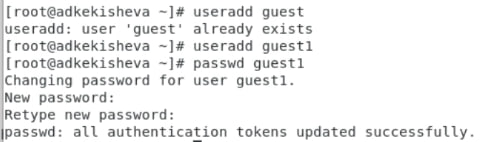{#fig:001 width=70%}

2. Перезагрузила компьютер и вошла в систему от имени пользователя guest1 (рис. @fig:002). 
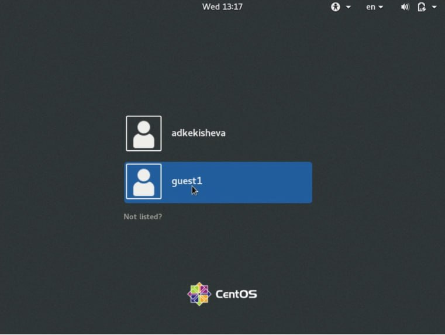{#fig:002 width=70%}

3. Определила директорию, в которой я нахожусь, командой pwd. Сравните её с приглашением командной строки: в приглашении командной строки у меня написано имя пользователя и нахожусь я в этой же директории, которая находится в домашней. Также уточнила имя пользователя командой whoami (рис. @fig:003).
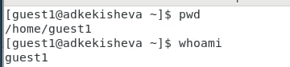{#fig:003 width=70%}

5. Уточнила имя моего пользователя, его группу, а также группы, куда входит пользователь, командой id. Вышло, что uid = gid = 1002 (рис. @fig:004).
Сравнила вывод id с выводом команды groups: команда groups выводит письменное название группы, а команда id выдела и числовой вариант и письменный.
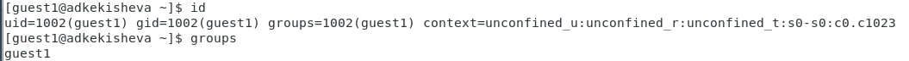{#fig:004 width=70%}

Сравнила полученную информацию об имени пользователя с данными, выводимыми в приглашении командной строки: они идентичны.

6. Просмотрела файл /etc/passwd командой cat (рис. @fig:005).
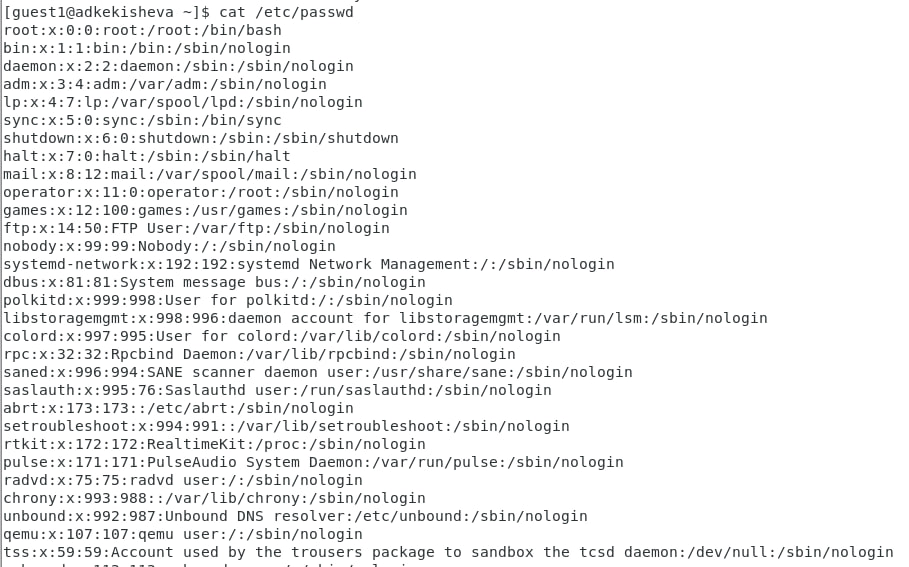{#fig:005 width=70%}
 
7. С помощью команды grep нашла в файле свою учётную запись. Определить uid, gid пользователя не получилось, информации в файлов нет (рис. @fig:006).
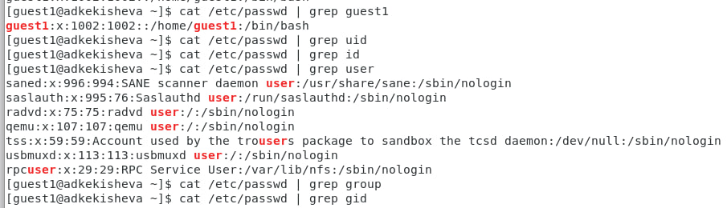{#fig:006 width=70%}

8. Определила существующие в системе директории командой ls -l /home/.
Мне удалось получить список поддиректорий директории /home. На всех дикреториях уснановлены права чтения, записи и запуска только для владельца, ни группы, никто другой не имеет доступа к ним (рис. @fig:006).
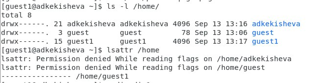{#fig:007 width=70%}

10. Проверила, какие расширенные атрибуты установлены на поддиректо-
риях, находящихся в директории /home, командой lsattr /home (рис. @fig:007).
Мне удалось увидеть расширенные атрибуты директории -- их нет, все минусы. Расширенные атрибуты директорий других пользователей мне не доступны -- доступ запрещён.

11. Создала в домашней директории поддиректорию dir1 командой mkdir dir1 и определила командами ls -l и lsattr, какие права доступа и расширенные атрибуты были выставлены на директорию dir1 (рис. @fig:008). Как видим, папку dir1 нельзя только изменять остальным пользователям, для груп и владельца разрешены все действия, а расширенных атрибутов нет.
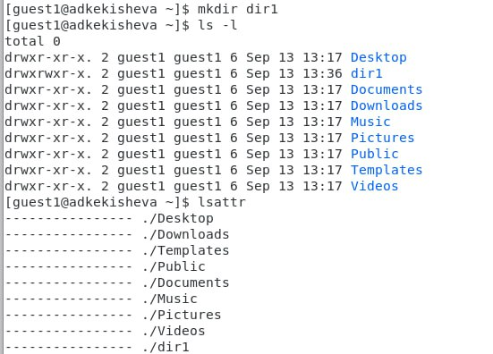{#fig:008 width=70%}

12. Сняла с директории dir1 все атрибуты командой chmod 000 dir1 и проверила правильность выполнения команды ls -l (рис. @fig:009). Как видим, команда выполнилась верно -- прав на папку нет ни у кого.
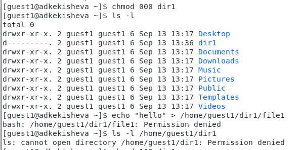{#fig:009 width=70%}

13. Попыталась создать в директории dir1 файл file1 командой echo "test" > /home/guest/dir1/file1, но получила отказ в выполнении, это произошло, так как мы выполни команду chmod 000, которая убрала все наши права на папку и сделала невозможным создание в ней файла.
Провела командой ls -l /home/guest/dir1 действительно ли файл file1 не находится внутри директории dir1. Точно сказать так нельзя, так как в ошибке он не вывел, что нет такой папки, он просто сказал, что нам отклонено в доступе (рис. @fig:009).

14. Заполнила таблицу «Установленные права и разрешённые действия» @tbl:001
Прверяла права экспериментным пуём, командами touch, mv, rm, ls, ls -l, lsattr, действия представлены на рис. @fig:010, @fig:011, @fig:012, @fig:013, @fig:014.
Понятно, что ту не все действия, которые я произвела, но принцип и подход был везде одинаков.

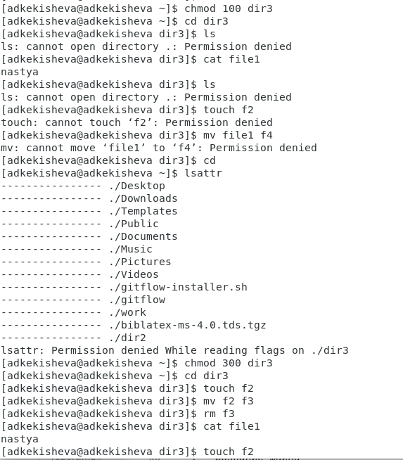{#fig:010 width=70%}
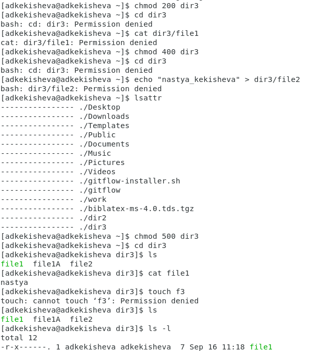{#fig:011 width=70%}
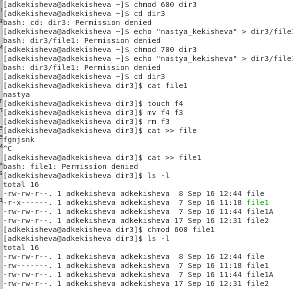{#fig:012 width=70%}
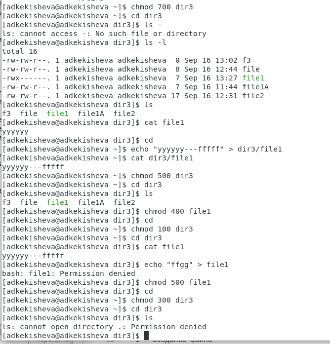{#fig:013 width=70%}
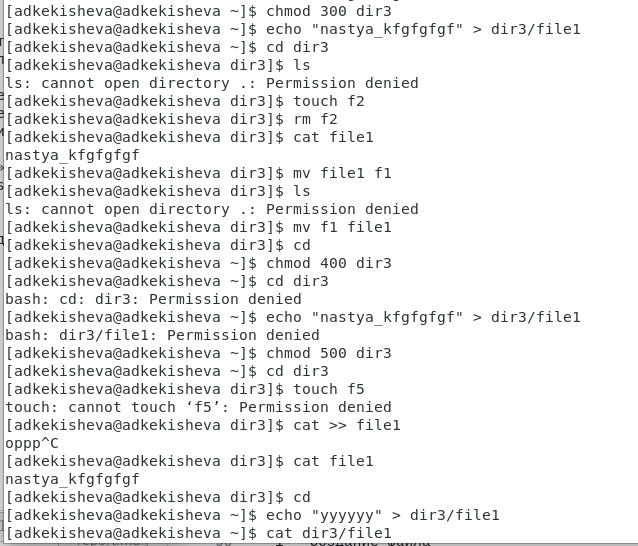{#fig:014 width=70%}

: Установленные права и разрешённые действия {#tbl:001}
|Права директории|Права файла|Соз.ф|Удл.ф|Зап.ф|Чт.ф|См.дир|Пр.ф.д|Переим.ф|Смен.атрб.ф|
|:---|:---|---|---|---|---|---|---|---|---|
|```d---------(000)```|```----------(000)```|-|-|-|-|-|-|-|-|
|```d--x------(100)```|```----------(000)```|-|-|-|-|+|-|-|-|
|```d-w-------(200)```|```----------(000)```|-|-|-|-|-|-|-|-|
|```d-wx------(300)```|```----------(000)```|+|+|-|-|+|-|+|-|
|```dr--------(400)```|```----------(000)```|-|-|-|-|-|-|-|-|
|```dr-x------(500)```|```----------(000)```|-|-|-|-|+|+|-|+|
|```drw-------(600)```|```----------(000)```|-|-|-|-|-|-|-|-|
|```drwx------(700)```|```----------(000)```|+|+|-|-|+|+|+|+|
|```drwx------(000)```|```---x------(100)```|-|-|-|-|-|-|-|-|
|```d--x------(100)```|```---x------(100)```|-|-|-|-|+|-|-|-|
|```d-w-------(200)```|```---x------(100)```|-|-|-|-|-|-|-|-|
|```d-wx------(300)```|```---x------(100)```|+|+|-|-|+|-|+|-|
|```dr--------(400)```|```---x------(100)```|-|-|-|-|-|-|-|-|
|```dr-x------(500)```|```---x------(100)```|-|-|-|-|+|+|-|+|
|```drw-------(600)```|```---x------(100)```|-|-|-|-|-|-|-|-|
|```drwx------(700)```|```---x------(100)```|+|+|-|-|+|+|+|+|
|```d---------(000)```|```--w-------(200)```|-|-|-|-|-|-|-|-|
|```d--x------(100)```|```--w-------(200)```|-|-|+|-|+|-|-|-|
|```d-w-------(200)```|```--w-------(200)```|-|-|-|-|-|-|-|-|
|```d-wx------(300)```|```--w-------(200)```|+|+|+|-|+|-|+|-|
|```dr--------(400)```|```--w-------(200)```|-|-|-|-|-|-|-|-|
|```dr-x------(500)```|```--w-------(200)```|-|-|+|-|+|+|-|+|
|```drw-------(600)```|```--w-------(200)```|-|-|-|-|-|-|-|-|
|```drwx------(700)```|```--w-------(200)```|+|+|+|-|+|+|+|+|
|```d---------(000)```|```--wx------(300)```|-|-|-|-|-|-|-|-|
|```d--x------(100)```|```--wx------(300)```|-|-|+|-|+|-|-|-|
|```d-w-------(200)```|```--wx------(300)```|-|-|-|-|-|-|-|-|
|```d-wx------(300)```|```--wx------(300)```|+|+|+|-|+|-|+|-|
|```dr--------(400)```|```--wx------(300)```|-|-|-|-|-|-|-|-|
|```dr-x------(500)```|```--wx------(300)```|-|-|+|-|+|+|-|+|
|```drw-------(600)```|```--wx------(300)```|-|-|-|-|-|-|-|-|
|```drwx------(700)```|```--wx------(300)```|+|+|+|-|+|+|+|+|
|```d---------(000)```|```-r--------(400)```|-|-|-|-|-|-|-|-|
|```d--x------(100)```|```-r--------(400)```|-|-|-|+|+|-|-|-|
|```d-w-------(200)```|```-r--------(400)```|-|-|-|-|-|-|-|-|
|```d-wx------(300)```|```-r--------(400)```|+|+|-|+|+|-|+|-|
|```dr--------(400)```|```-r--------(400)```|-|-|-|-|-|-|-|-|
|```dr-x------(500)```|```-r--------(400)```|-|-|-|+|+|+|-|+|
|```drw-------(600)```|```-r--------(400)```|-|-|-|-|-|-|-|-|
|```drwx------(700)```|```-r--------(400)```|+|+|-|+|+|+|+|+|
|```d---------(000)```|```-r-x------(500)```|-|-|-|-|-|-|-|-|
|```d--x------(100)```|```-r-x------(500)```|-|-|-|+|+|-|-|-|
|```d-w-------(200)```|```-r-x------(500)```|-|-|-|-|-|-|-|-|
|```d-wx------(300)```|```-r-x------(500)```|+|+|-|+|+|-|+|-|
|```dr--------(400)```|```-r-x------(500)```|-|-|-|-|-|-|-|-|
|```dr-x------(500)```|```-r-x------(500)```|-|-|-|+|+|+|-|+|
|```drw-------(600)```|```-r-x------(500)```|-|-|-|-|-|-|-|-|
|```drwx------(700)```|```-r-x------(500)```|+|+|-|+|+|+|+|+|
|```d---------(000)```|```-rw-------(600)```|-|-|-|-|-|-|-|-|
|```d--x------(100)```|```-rw-------(600)```|-|-|+|+|+|-|-|-|
|```d-w-------(200)```|```-rw-------(600)```|-|-|-|-|-|-|-|-|
|```d-wx------(300)```|```-rw-------(600)```|+|+|+|+|+|-|+|-|
|```dr--------(400)```|```-rw-------(600)```|-|-|-|-|-|-|-|-|
|```dr-x------(500)```|```-rw-------(600)```|-|-|-|+|+|+|-|+|
|```drw-------(600)```|```-rw-------(600)```|-|-|-|-|-|-|-|-|
|```drwx------(700)```|```-rw-------(600)```|+|+|+|+|+|+|+|+|
|```d---------(000)```|```-rwx------(700)```|-|-|-|-|-|-|-|-|
|```d--x------(100)```|```-rwx------(700)```|-|-|+|+|+|-|-|-|
|```d-w-------(200)```|```-rwx------(700)```|-|-|-|-|-|-|-|-|
|```d-wx------(300)```|```-rwx------(700)```|+|+|+|+|+|-|+|-|
|```dr--------(400)```|```-rwx------(700)```|-|-|-|-|-|-|-|-|
|```dr-x------(500)```|```-rwx------(700)```|-|-|+|+|+|+|-|+|
|```drw-------(600)```|```-rwx------(700)```|-|-|-|-|-|-|-|-|
|```drwx------(700)```|```-rwx------(700)```|+|+|+|+|+|+|+|+|


Далее на основе предыдущей таблицы составила таб.@tbl:002
: Минимальные права для совершения операций {#tbl:002}

|Операция|Права на директорию|Права на файл|
|:---:|:---:|:---:|
|Создание файла|```d-wx------ (300)```|```---------- (000)```|
|Удаление файла|```d-wx------ (300)```|```---------- (000)```|
|Чтение файла|```d--x------ (100)```|```-r-------- (400)```|
|Запись в файл|```d--x------ (100)```|```--w------- (200)```|
|Переименование файла|```d-wx------ (300)```|```----------(000)```|
|Создание поддиректории|```d-wx------ (300)```|```---------- (000)```|
|Удаление поддиректории|```d-wx------ (300)```|```---------- (000)```|
# Выводы

1. Создала учётную запись пользователя guest и задайть пароль и проделать последовательность команд, описанных в [1], которые направлены на изучения поведения прав дикерторий и файлов.
2. Заполнила таблицу «Установленные права и разрешённые действия»;
3. Заполнила таблицу «Минимально необходимые права для выполнения операций внутри директории».


# Список литературы{.unnumbered}

1. Лабораторная работа No 4. Дискреционное разграничение прав в Linux. Расширенные атрибуты [Электронный ресурс]. URL: https://esystem.rudn.ru/pluginfile.php/2090411/mod_resource/content/6/002-lab_discret_attr.pdf.
2. Терминал Linux. Права доступа к каталогам и файлам в Linux, команды chmod и chown [Электронный ресурс].URL: https://linuxrussia.com/terminal-chmod-chown.html.
3. Обработка Атрибутов Файлов [Электронный ресурс]. URL: http://linux.yaroslavl.ru/docs/setup/mandrake/cl/cmdline-attr.html.
