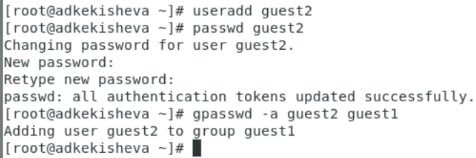
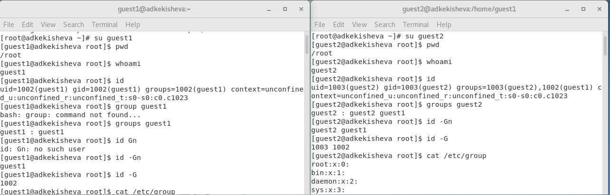
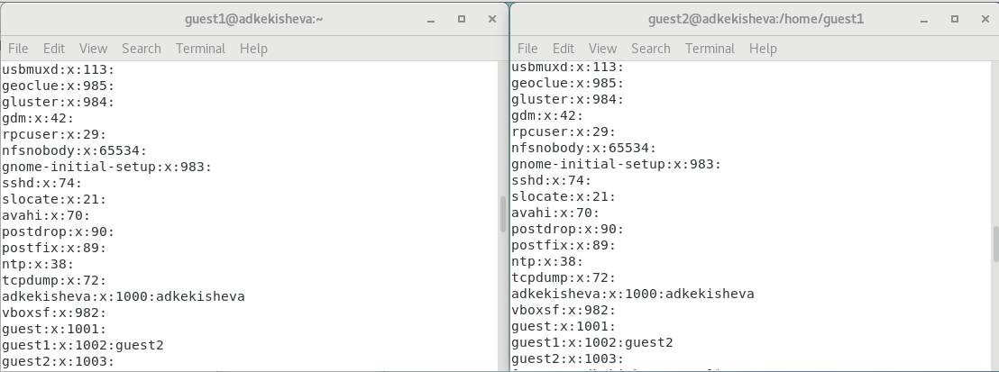
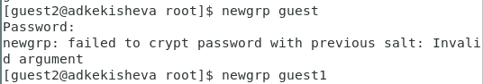
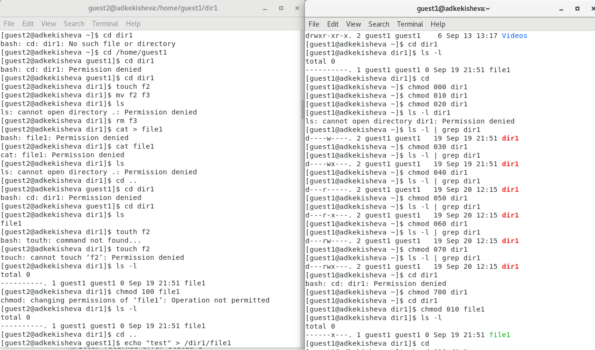
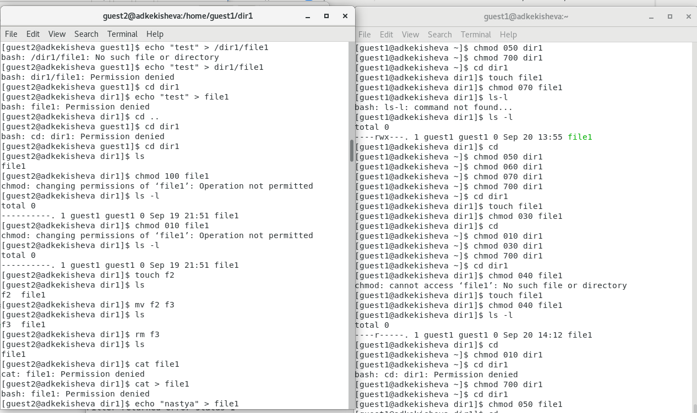
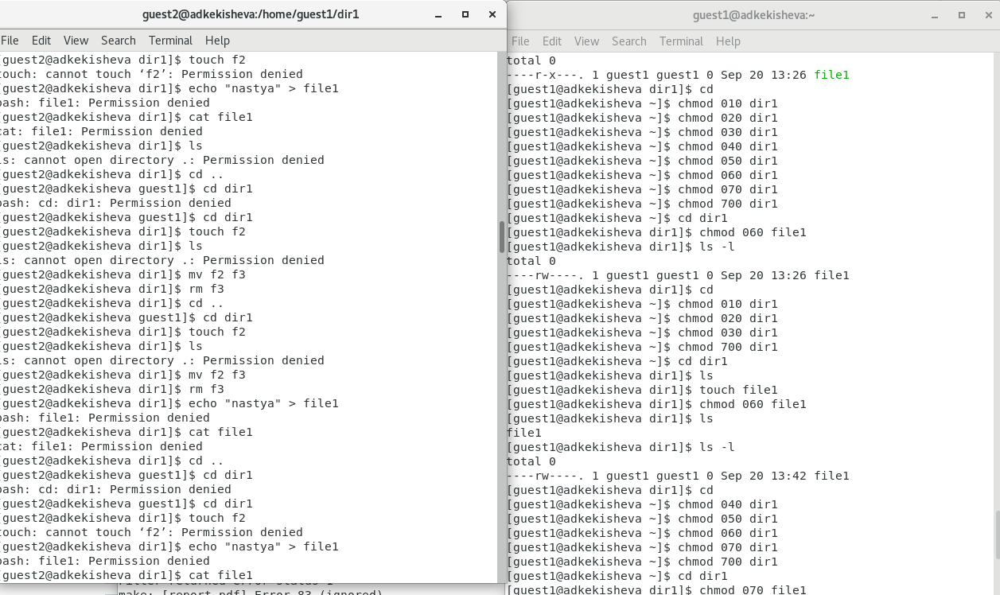
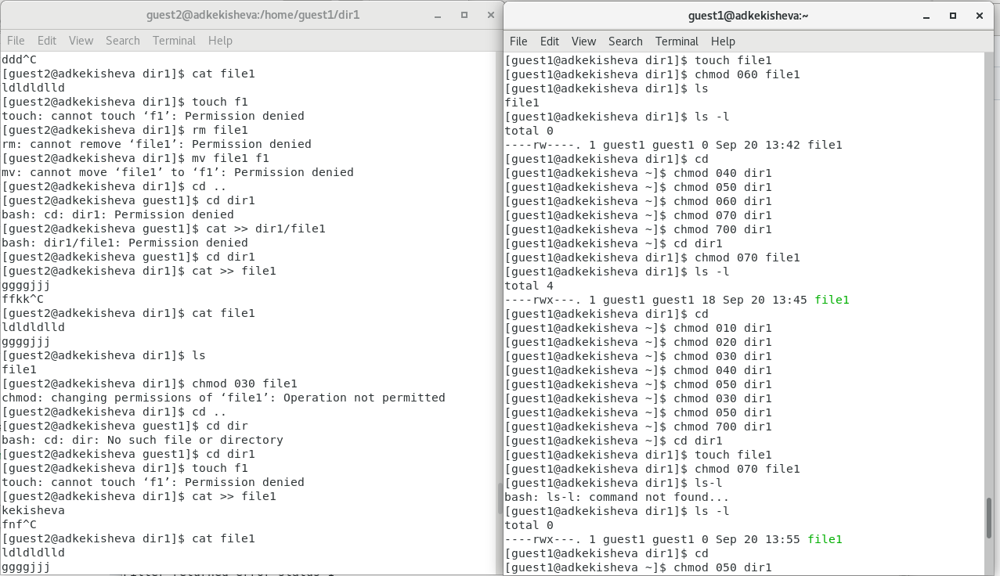
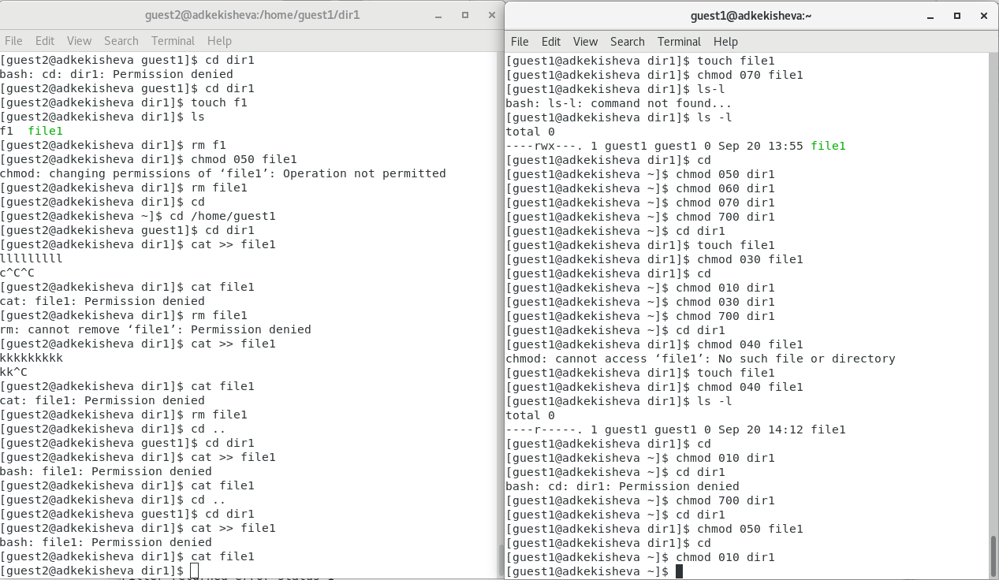

---
## Front matter
lang: ru-RU
title: Лабораторная работа №3
subtitle: Дискреционное разграничение прав в Linux. Два пользователя.
author:
  - Кекишева А.Д.
institute:
  - Российский университет дружбы народов, Москва, Россия
date: 22 сентября 2023

## i18n babel
babel-lang: russian
babel-otherlangs: english

## Formatting pdf
toc: false
toc-title: Содержание
slide_level: 2
aspectratio: 169
section-titles: true
theme: metropolis
header-includes:
 - \metroset{progressbar=frametitle,sectionpage=progressbar,numbering=fraction}
 - '\makeatletter'
 - '\beamer@ignorenonframefalse'
 - '\makeatother'
---

# Докладчик

:::::::::::::: {.columns align=center}
::: {.column width="70%"}

  * Кекишева Анастасия Дмитриевна
  * Бизнес-информатика
  * Кафедра теории веротности и кибербезопасности
  * Российский университет дружбы народов
  * 1032201194@pfur.ru
  * <https://github.com/adkekisheva>

:::
::: {.column width="30%"}

:::
::::::::::::::

# Выполнение лабораторной работы №3

# Шаг 1 - Создание guest2 и добаление его в группу guest1

{#fig:001 width=70%}

# Шаг 2 - Команды id, id -Gn, id -G, groups

{#fig:002 width=70%}

# Шаг 3 - Просмотр содержимого файл /etc/group

{#fig:003 width=70%}

# Шаг 4 - Регистрация пользователя guest2 в группе guest1

{#fig:004 width=70%}

# Шаг 5 - Изменение прав директорий

{#fig:005 width=70%}    

# Шаг 6.1 - Заполнение таблицы

{#fig:006 width=70%}    

# Шаг 6.2 - Заполнение таблицы

{#fig:007 width=70%}    

# Шаг 6.3 - Заполнение таблицы

{#fig:008 width=70%}    

# Шаг 6.4 - Заполнение таблицы

{#fig:009 width=70%}    

# Шаг 6.5 - Заполнение таблицы

{#fig:0010 width=70%}    

# Шаг 7 - Заполнение второй таблицы

\begin{table}[H]
\caption{Минимальные права для совершения операций от имени пользователей входящих в групп}
\begin{center}
\begin{tabular}{|c|c|c|}
\hline
Операция & Права на директорию & Права на файл\\
\hline
Создание файла & (030) & (000)\\
\hline
Удаление файла & (030) & (000)\\
\hline
Чтение файла & (010) & (040)\\
\hline
Запись в файл & (010) & (020)\\
\hline
Переименование файла & (030) & (000)\\
\hline
Создание поддиректории & (030) & (000)\\
\hline
Удаление поддиректории & (030) & (000)\\
\hline
\end{tabular}
\end{center}
\end{table}

# Выводы

1. Создала учётную запись пользователя guest2 и проделать последовательность команд, описанных в лабораторной, которые направлены на изучения поведения прав дикерторий и файлов -- научилась задавать права для групп пользователей.
2. Заполнила таблицу «Установленные права и разрешённые действия для групп»;
3. Заполнила таблицу «Минимальные права для совершения операций от имени пользователей
входящих в групп».

