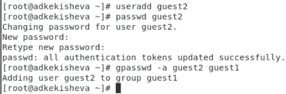
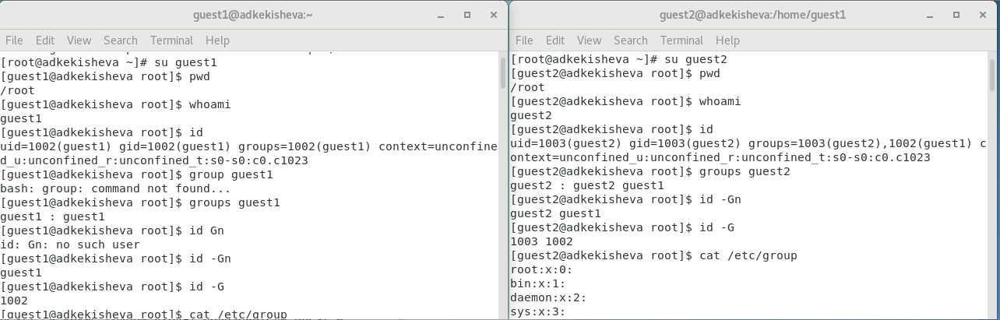
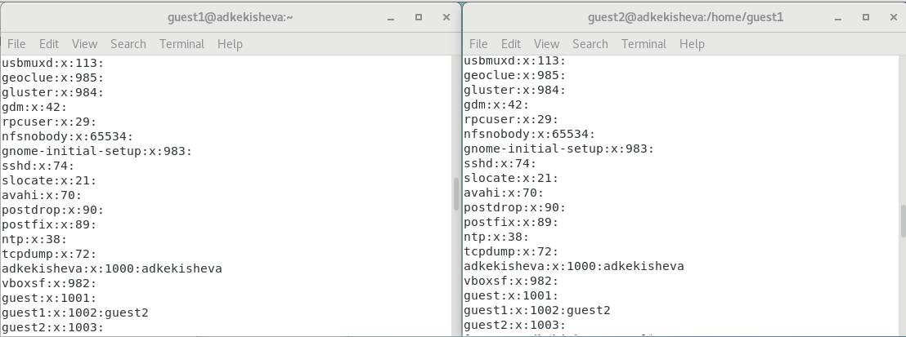
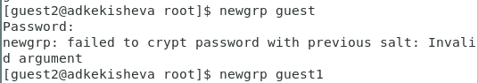
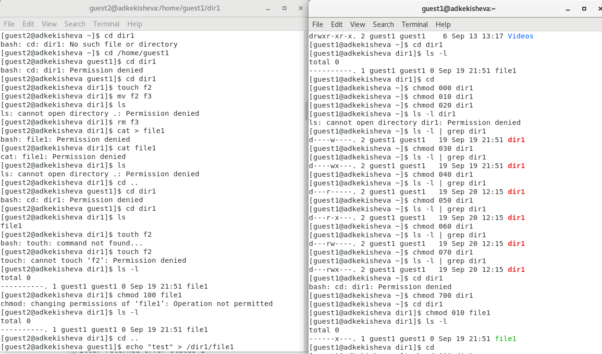
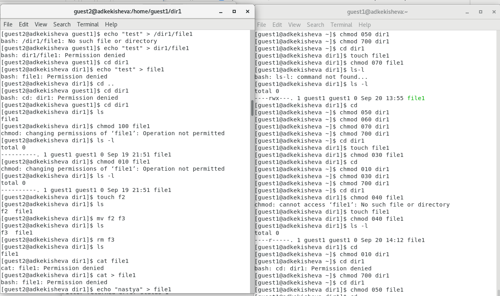
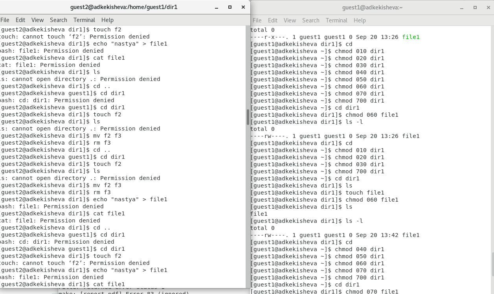
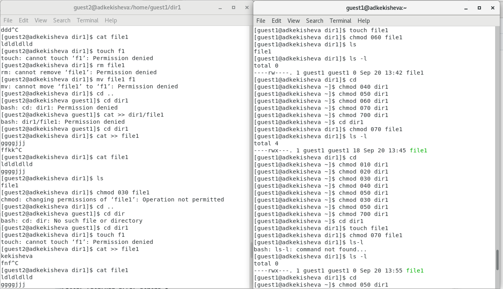
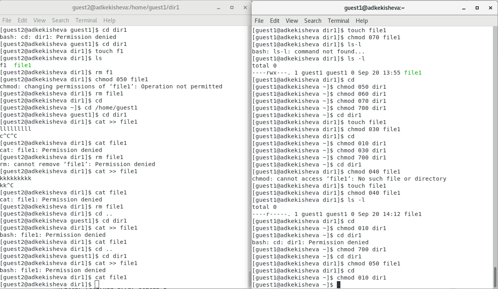

---
## Front matter
title: "Лабораторная работа №3"
subtitle: "Дискреционное разграничение прав в Linux. Два пользователя"
author: "Кекишева Анасатсия Дмитриевна"

## Generic otions
lang: ru-RU
toc-title: "Содержание"

## Bibliography
bibliography: bib/cite.bib
csl: pandoc/csl/gost-r-7-0-5-2008-numeric.csl

## Pdf output format
toc: true # Table of contents
toc-depth: 2
lof: true # List of figures
lot: true # List of tables
fontsize: 12pt
linestretch: 1.5
papersize: a4
documentclass: scrreprt
## I18n polyglossia
polyglossia-lang:
  name: russian
  options:
	- spelling=modern
	- babelshorthands=true
polyglossia-otherlangs:
  name: english
## I18n babel
babel-lang: russian
babel-otherlangs: english
## Fonts
mainfont: PT Serif
romanfont: PT Serif
sansfont: PT Sans
monofont: PT Mono
mainfontoptions: Ligatures=TeX
romanfontoptions: Ligatures=TeX
sansfontoptions: Ligatures=TeX,Scale=MatchLowercase
monofontoptions: Scale=MatchLowercase,Scale=0.9
## Biblatex
biblatex: true
biblio-style: "gost-numeric"
biblatexoptions:
  - parentracker=true
  - backend=biber
  - hyperref=auto
  - language=auto
  - autolang=other*
  - citestyle=gost-numeric
## Pandoc-crossref LaTeX customization
figureTitle: "Рис."
tableTitle: "Таблица"
listingTitle: "Листинг"
lofTitle: "Список иллюстраций"
lotTitle: "Список таблиц"
lolTitle: "Листинги"
## Misc options
indent: true
header-includes:
  - \usepackage{indentfirst}
  - \usepackage{longtable}
  - \usepackage{float} # keep figures where there are in the text
  - \floatplacement{figure}{H} # keep figures where there are in the text
---

# Цель работы

Получение практических навыков работы в консоли с атрибутами файлов для групп пользователей.

# Задание

1. Проделать последовательность действий, описанных в задание к лабораторной работе [@bib1] : создать второго пользователя, группы и работа с ними;
2. Заполнить таблцу "Установленные права и разрешённые действия для групп";
3. Заполнить таблицу "Минимальные права для совершения операций от имени пользователей
входящих в групп".

# Теоретическое введение

**Атрибуты файлов в Linux**

У каждого файла имеется определённый набор свойств в файловой системе. Например, это права доступа, владелец, имя, метки времени. В Linux каждый файл имеет довольно много свойств, например, права доступа устанавливаются трижды (для владельца, группы и всех прочих), метки времени также бывают трёх разных видов (время создание, доступа и изменения)[@bib2].

Часть свойств файлов в текущей директории можно посмотреть командой: ls -l

Пример свойств одного из файлов:	
-rw-rw-r-- 1 mial users 262144 авг 18 15:04 custom-x.cramfs.img

- Первая группа из трех символов обозначает права доступа владельца файла или директории (u - user). 
- Вторая группа из трех символов обозначает права доступа на файл или директорию для системной группы (g - group).
- Третья группа из трех символов обозначает права доступа на файл или директорию для всех остальных (o - other).

Каждая из трёх групп может содержать разный набор символов: 

**r** - read, то есть, право доступа на чтение файла или директории.
**w** - write, то есть, право на изменение и удаление файла или директории.
**x** - execute, то есть, право на запуск файла как программы или вход в директорию.

# Выполнение лабораторной работы

1. Создала второго пользователя guest2 аналогично guest1, которго создавала в прошлой лабораторной(рис. @fig:001).    
2. Добавила пользователя guest2 в группу guest, командой gpasswd -a guest2 guest (рис. @fig:001).    

{#fig:001 width=90%}

3. Осуществила вход в систему от двух пользователей на двух разных консолях: guest на первой консоли и guest2 на второй консоли (рис. @fig:002).

4. Для обоих пользователей командой pwd определите директорию, в которой я нахожусь. Я нахожусь в root это видно и по приглашению командной строки (рис. @fig:002).
5. Далее использовала ряд команд, с помощью которых проверила имя моего пользователя, его группу, кто входит в неё и к каким группам принадлежит он сам. Также определила командами groups guest и groups guest2, в какие группы входят пользователи guest и guest2. Применила также команды id -Gn и id -G вывод с командой groups  практически не отличается, за исключением, что groups  выводит группу и кто в неё входит, id -Gn просто выводит пользователей, которые находяться в группе - без названия, а id -G выводи не названия пользователей в группе, а их id-номер (рис. @fig:002).    

{#fig:002 width=90%}

6. Просмотрела файл /etc/group командой cat /etc/group (рис. @fig:002). Сравнивая их содержимое, видно, что второй пользователь входит в группу guest1 (рис. @fig:003).    

{#fig:003 width=90%}

7. От имени пользователя guest2 выполнила регистрацию пользователя guest2 в группе guest1 командой newgrp guest1 (рис. @fig:004).    

{#fig:004 width=90%}

8. От имени пользователя guest1 изменила права директории /home/guest1,
разрешив все действия для пользователей группы: chmod g+rwx /home/guest1 (рис. @fig:005).    
9. От имени пользователя guest снимите с директории /home/guest1/dir1
все атрибуты командой chmod 000 dir1 (рис. @fig:005).    

{#fig:005 width=90%}    

10. Меняя атрибуты у директории dir1 и файла file1 от имени пользователя guest1 и делая проверку от пользователя guest2, приступила к заполнению таблицы "Установленные права и разрешённые действия для групп" (таб. \ref{tbl:001}), определив опытным путём, какие операции разрешены, а какие нет. (рис. @fig:006, @fig:007, @fig:008, @fig:009, @fig:010).    

{#fig:006 width=90%}    

{#fig:007 width=90%}    

{#fig:008 width=90%}    

{#fig:009 width=90%}    

{#fig:0010 width=90%}    

Ниже представлена заполненная таблица: Установленные права и разрешённые действия для групп \ref{tbl:001}     

\begin{center}
\begin{longtable}{|p{1.5cm}|p{1.5cm}|p{1.2cm}|p{1.2cm}|p{1.2cm}|p{1.2cm}|p{1.2cm}|p{1.2cm}|p{1.2cm}|p{1.2cm}|}
\caption{Установленные права и разрешённые действия для групп \label{tbl:001}} \\
\hline
Права директории & Права файла & Создание файла & Удаление файла & Запись файла & Чтение файла & Просмотр директории & Перемещение файла & Переименование файла & Смена атрибутов файла\\
\hline
(000) & (000) & - & - & - & - & - & - & - & -\\
(010) & (000) & - & - & - & - & + & - & - & -\\
(020) & (000) & - & - & - & - & - & - & - & -\\
(030) & (000) & + & + & - & - & + & - & + & -\\
(040) & (000) & - & - & - & - & - & - & - & -\\
(050) & (000) & - & - & - & - & + & + & - & -\\
(060) & (000) & - & - & - & - & - & - & - & -\\
(070) & (000) & + & + & - & - & + & + & + & -\\
\hline
(000) & (010) & - & - & - & - & + & - & - & -\\
(010) & (010) & - & - & - & - & + & - & - & -\\
(020) & (010) & - & - & - & - & - & - & - & -\\
(030) & (010) & + & + & - & - & + & - & + & -\\
(040) & (010) & - & - & - & - & - & - & - & -\\
(050) & (010) & - & - & - & - & + & + & - & -\\
(060) & (010) & - & - & - & - & - & - & - & -\\
(070) & (010) & + & + & - & - & + & + & + & -\\
\hline
(000) & (020) & - & - & - & - & - & - & - & -\\
(010) & (020) & - & - & + & - & + & - & - & -\\
(020) & (020) & - & - & - & - & - & - & - & -\\
(030) & (020) & + & + & + & - & + & - & + & -\\
(040) & (020) & - & - & - & - & - & - & - & -\\
(050) & (020) & - & - & - & - & - & - & - & -\\
(060) & (020) & - & - & + & - & + & + & - & -\\
(070) & (020) & + & + & + & - & + & + & + & -\\
\hline
(000) & (030) & - & - & - & - & - & - & - & -\\
(010) & (030) & - & - & + & - & + & - & - & -\\
(020) & (030) & - & - & - & - & - & - & - & -\\
(030) & (030) & + & + & + & - & + & - & + & -\\
(040) & (030) & - & - & - & - & - & - & - & -\\
(050) & (030) & - & - & + & - & + & + & - & -\\
(060) & (030) & - & - & - & - & - & - & - & -\\
(070) & (030) & + & + & + & - & + & + & + & -\\
\hline
(000) & (040) & - & - & - & - & - & - & - & -\\
(010) & (040) & - & - & - & + & + & - & - & -\\
(020) & (040) & - & - & - & - & - & - & - & -\\
(030) & (040) & + & + & - & + & + & - & + & -\\
(040) & (040) & - & - & - & - & - & - & - & -\\
(050) & (040) & - & - & - & + & + & + & - & -\\
(060) & (040) & - & - & - & - & - & - & - & -\\
(070) & (040) & + & + & - & + & + & + & + & -\\
\hline
(000) & (050) & - & - & - & - & - & - & - & -\\
(010) & (050) & - & - & - & + & + & - & - & -\\
(020) & (050) & - & - & - & - & - & - & - & -\\
(030) & (050) & + & + & - & + & + & - & + & -\\
(040) & (050) & - & - & - & - & - & - & - & -\\
(050) & (050) & - & - & - & + & + & + & - & -\\
(060) & (050) & - & - & - & - & - & - & - & -\\
(070) & (050) & + & + & - & + & + & + & + & -\\
\hline
(000) & (060) & - & - & - & - & - & - & - & -\\
(010) & (060) & - & - & + & + & + & - & - & -\\
(020) & (060) & - & - & - & - & - & - & - & -\\
(030) & (060) & + & + & + & + & + & - & + & -\\
(040) & (060) & - & - & - & - & - & - & - & -\\
(050) & (060) & - & - & + & + & + & + & - & -\\
(060) & (060) & - & - & - & - & - & - & - & -\\
(070) & (060) & + & + & + & + & + & + & + & -\\
\hline
(000) & (070) & - & - & - & - & - & - & - & -\\
(010) & (070) & - & - & + & + & + & - & - & -\\
(020) & (070) & - & - & - & - & - & - & - & -\\
(030) & (070) & + & + & + & + & + & - & + & -\\
(040) & (070) & - & - & - & - & - & - & - & -\\
(050) & (070) & - & - & + & + & + & + & - & -\\
(060) & (070) & - & - & - & - & - & - & - & -\\
(070) & (070) & + & + & + & + & + & + & + & -\\
\hline
\end{longtable}
\end{center}

Далее на основе предыдущей таблицы составила таб. \ref{tbl:002}    

\begin{table}[H]
\caption{Минимальные права для совершения операций от имени пользователей входящих в групп \label{tbl:002}}
\begin{center}
\begin{tabular}{|c|c|c|}
\hline
Операция & Права на директорию & Права на файл\\
\hline
Создание файла & (030) & (000)\\
\hline
Удаление файла & (030) & (000)\\
\hline
Чтение файла & (010) & (040)\\
\hline
Запись в файл & (010) & (020)\\
\hline
Переименование файла & (030) & (000)\\
\hline
Создание поддиректории & (030) & (000)\\
\hline
Удаление поддиректории & (030) & (000)\\
\hline
\end{tabular}
\end{center}
\end{table}

# Выводы

1. Создала учётную запись пользователя guest2 и проделать последовательность команд, описанных в [@bib1], которые направлены на изучения поведения прав дикерторий и файлов -- научилась задавать права для групп пользователей.
2. Заполнила таблицу \ref[tbl:001} «Установленные права и разрешённые действия для групп»;
3. Заполнила таблицу \ref{tbl:002} «Минимальные права для совершения операций от имени пользователей
входящих в групп».

# Список литературы{.unnumbered}

::: {#refs}
:::
