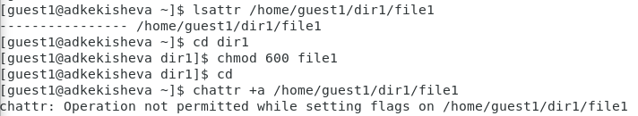
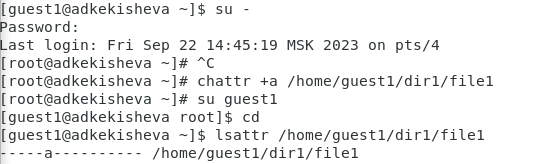
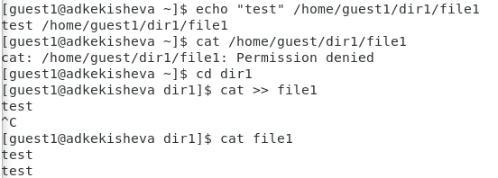
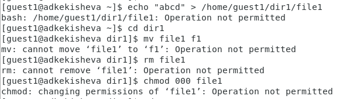
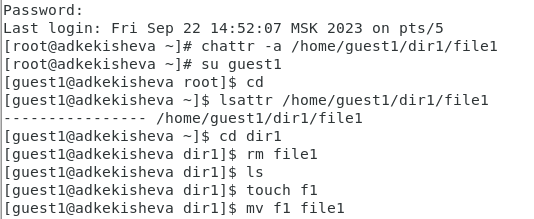
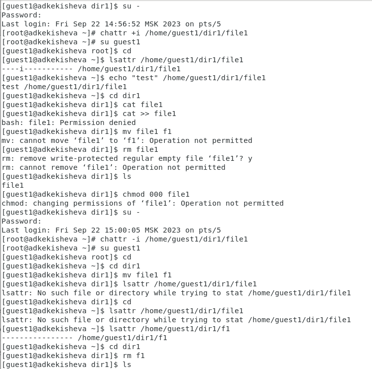

---
## Front matter
lang: ru-RU
title: Лабораторная работа №4
subtitle: Дискреционное разграничение прав в Linux. Расширенные атрибуты.
author:
  - Кекишева А.Д.
institute:
  - Российский университет дружбы народов, Москва, Россия
date: 22 сентября 2023

## i18n babel
babel-lang: russian
babel-otherlangs: english

## Formatting pdf
toc: false
toc-title: Содержание
slide_level: 2
aspectratio: 169
section-titles: true
theme: metropolis
header-includes:
 - \metroset{progressbar=frametitle,sectionpage=progressbar,numbering=fraction}
 - '\makeatletter'
 - '\beamer@ignorenonframefalse'
 - '\makeatother'
---

# Докладчик

:::::::::::::: {.columns align=center}
::: {.column width="70%"}

  * Кекишева Анастасия Дмитриевна
  * Бизнес-информатика
  * Кафедра теории веротности и кибербезопасности
  * Российский университет дружбы народов
  * 1032201194@pfur.ru
  * <https://github.com/adkekisheva>

:::
::: {.column width="30%"}
:::
::::::::::::::

# Выполнение лабораторной работы №3

a -- файл с установленным атрибутом «a» можно открыть только в режиме добавления для записи. Только суперпользователь может установить или очистить этот атрибут. 
i -- файл с атрибутом «i» не может быть изменён: его нельзя удалить или переименовать, нельзя создать ссылку на этот файл, большую часть метаданных файла нельзя изменить, и файл нельзя открыть в режиме записи. Только суперпользователь может установить или очистить этот атрибут. 

# Шаг 1

{#fig:001 width=70%}    

# Шаг 2

{#fig:002 width=70%}    

# Шаг 3

{#fig:003 width=70%}    

# Шаг 4

{#fig:004 width=70%}    

# Шаг 5

{#fig:005 width=70%}    

# Шаг 6

{#fig:006 width=70%}    

# Выводы

В результате выполнения работы вы повысили свои навыки использования интерфейса командой строки (CLI), познакомились на примерах с тем, как используются основные и расширенные атрибуты при разграничении доступа. Опробовала действие на практике расширенных атрибутов «а» и «i». Только суперпользователь может установить или очистить этот атрибут.

