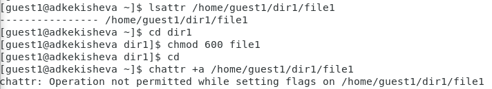
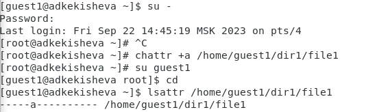
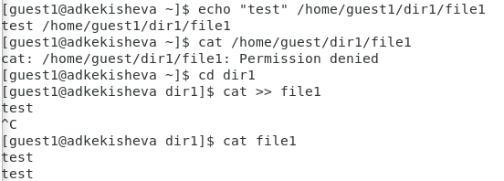
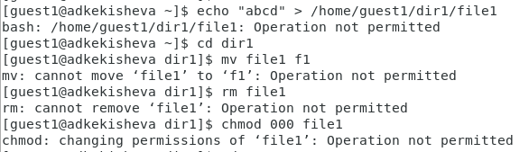
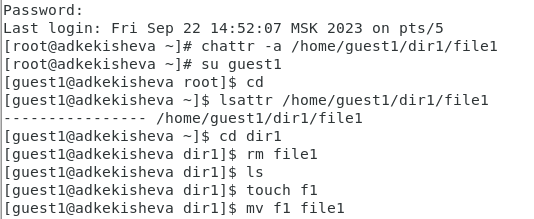

---
## Front matter
title: "Лабораторная работа №4"
subtitle: "Дискреционное разграничение прав в Linux. Расширенные атрибуты"
author: "Кекишева Анасатсия Дмитриевна"

## Generic otions
lang: ru-RU
toc-title: "Содержание"

## Bibliography
bibliography: bib/cite.bib
csl: pandoc/csl/gost-r-7-0-5-2008-numeric.csl

## Pdf output format
toc: true # Table of contents
toc-depth: 2
lof: true # List of figures
lot: true # List of tables
fontsize: 12pt
linestretch: 1.5
papersize: a4
documentclass: scrreprt
## I18n polyglossia
polyglossia-lang:
  name: russian
  options:
	- spelling=modern
	- babelshorthands=true
polyglossia-otherlangs:
  name: english
## I18n babel
babel-lang: russian
babel-otherlangs: english
## Fonts
mainfont: PT Serif
romanfont: PT Serif
sansfont: PT Sans
monofont: PT Mono
mainfontoptions: Ligatures=TeX
romanfontoptions: Ligatures=TeX
sansfontoptions: Ligatures=TeX,Scale=MatchLowercase
monofontoptions: Scale=MatchLowercase,Scale=0.9
## Biblatex
biblatex: true
biblio-style: "gost-numeric"
biblatexoptions:
  - parentracker=true
  - backend=biber
  - hyperref=auto
  - language=auto
  - autolang=other*
  - citestyle=gost-numeric
## Pandoc-crossref LaTeX customization
figureTitle: "Рис."
tableTitle: "Таблица"
listingTitle: "Листинг"
lofTitle: "Список иллюстраций"
lotTitle: "Список таблиц"
lolTitle: "Листинги"
## Misc options
indent: true
header-includes:
  - \usepackage{indentfirst}
  - \usepackage{float} # keep figures where there are in the text
  - \floatplacement{figure}{H} # keep figures where there are in the text
---

# Цель работы

Получение практических навыков работы в консоли с расширенными атрибутами файлов.

# Задание

Проделать последовательность действий, описанных в задание к лабораторной работе [@bib1] : поработать на практике с расширенными атрибутами «а» и «i».

# Теоретическое введение
Рассмотрим расширенные атрибуты, с которыми мне предстоит работать -- это a и i.

a -- файл с установленным атрибутом «a» можно открыть только в режиме добавления для записи. Только суперпользователь или процесс, обладающий возможностью CAP_LINUX_IMMUTABLE, может установить или очистить этот атрибут. 
i -- файл с атрибутом «i» не может быть изменён: его нельзя удалить или переименовать, нельзя создать ссылку на этот файл, большую часть метаданных файла нельзя изменить, и файл нельзя открыть в режиме записи. Только суперпользователь или процесс, обладающий возможностью CAP_LINUX_IMMUTABLE, может установить или очистить этот атрибут. 
Так, есть ещё атрибуты, которые можно усноваить - это f, c, s, u, d, e и т.д [@bib2]

Стоит отметить, что атрибуты «c», «s» и «u» не поддерживаются файловыми системами ext2, ext3 и ext4, как это реализовано в текущих основных ядрах Linux. Установка атрибутов «a» и «i» не повлияет на возможность записи в уже существующие файловые дескрипторы. 

Что касается команд, которые работают с атрибутами - основных их две:

1. chattr изменяет атрибуты файлов в файловой системе Linux. Оператор «+» вызывает добавление выбранных атрибутов к существующим атрибутам файлов; «-» заставляет их удалить; и «=» делает их единственными атрибутами файлов. 
2.  lsattr перечисляет атрибуты файлов в файловой системе Linux. 

# Выполнение лабораторной работы

1. От имени пользователя guest1 определите расширенные атрибуты файла file1 командой lsattr /home/guest/dir1/file1 (рис. @fig:001).    

2. Установите командой chmod 600 file1 на файл file1 права, разрешающие чтение и запись для владельца файла (рис. @fig:001).    

3. Попробовала установить на файл /home/guest/dir1/file1 расширенный атрибут a от имени пользователя guest1 командой chattr +a /home/guest1/dir1/file1
В ответ получила отказ от выполнения операции (рис. @fig:001).    

{#fig:001 width=70%}    

4. Повысила свои права с помощью команды su. И через суперпользователя попробовала установить расширенный атрибут a на файл /home/guest/dir1/file1 командой chattr +a /home/guest/dir1/file1 (рис. @fig:002).    

5. От пользователя guest1 проверьте правильность установления атрибута:
lsattr /home/guest/dir1/file1 (рис. @fig:002).    

{#fig:002 width=70%}    

6. Выполнила дозапись в файл file1 слова «test» командой echo "test" /home/guest/dir1/file1. После этого выполнила чтение файла file1 командой cat /home/guest/dir1/file1, но у меня не получилось, поэтому я перешла и посмотрела файл командой cat file1. Слово test было успешно записано в file1 (рис. @fig:003).    

{#fig:003 width=70%}    

7. Попробовала стереть имеющуюся в нём информацию командой echo "abcd" > /home/guest/dirl/file1, это действие было запрещено. Далее попробовала переименовать и удалить файл, а также сменить права командой chmod -- на что тоже получила отказ в действии (рис. @fig:004).    

{#fig:004 width=70%}    

8. Далее сняла расширенный атрибут a с файла /home/guest1/dirl/file1 от имени суперпользователя командой chattr -a /home/guest/dir1/file1. И повторила попытки переименовать и удалить файл (рис. @fig:005).    

{#fig:005 width=70%}    

9. Повторила действия по шагам, заменив атрибут «a» атрибутом «i». (рис. @fig:005).    

{#fig:005 width=70%}    

Мне не удалось ни записать в файл, ни удалить его, ни переименовать, лишь после снятия атрибута всё заработало. Это произошло потому, что файл с атрибутом «i» не может быть изменён: его нельзя удалить или переименовать, нельзя создать ссылку на этот файл, большую часть метаданных файла нельзя изменить, и файл нельзя открыть в режиме записи.

# Выводы

В результате выполнения работы вы повысили свои навыки использования интерфейса командой строки (CLI), познакомились на примерах с тем, как используются основные и расширенные атрибуты при разграничении доступа. Опробовала действие на практике расширенных атрибутов «а» и «i». Только суперпользователь может установить или очистить этот атрибут.

# Список литературы{.unnumbered}

::: {#refs}
:::
