---
## Front matter
lang: ru-RU
title: Лабораторная работа №6
subtitle: Мандатное разграничение прав в Linux
author:
  - Кекишева А.Д.
institute:
  - Российский университет дружбы народов, Москва, Россия
date: 10 октября 2023

## i18n babel
babel-lang: russian
babel-otherlangs: english

## Formatting pdf
toc: false
toc-title: Содержание
slide_level: 2
aspectratio: 169
section-titles: true
theme: metropolis
header-includes:
 - \metroset{progressbar=frametitle,sectionpage=progressbar,numbering=fraction}
 - '\makeatletter'
 - '\beamer@ignorenonframefalse'
 - '\makeatother'
---

# Информация

## Докладчик

:::::::::::::: {.columns align=center}
::: {.column width="70%"}

  * Кекишева Анастасия Дмитриевна
  * Бизнес-информатика
  * Кафедра теории веротности и кибербезопасности
  * Российский университет дружбы народов
  * 1032201194@pfur.ru
  * <https://github.com/adkekisheva>
:::
::: {.column width="30%"}
:::
::::::::::::::

# Цель работы

1. Развить навыки администрирования ОС Linux. Получить первое практическое знакомство с технологией SELinux1.
2. Проверить работу SELinx на практике совместно с веб-сервером Apache.

# Задание

Выполнить последовательность дейсвий описанных в лабораторной работе №6.

# Выполнение лабораторной работы

# Шаг 1

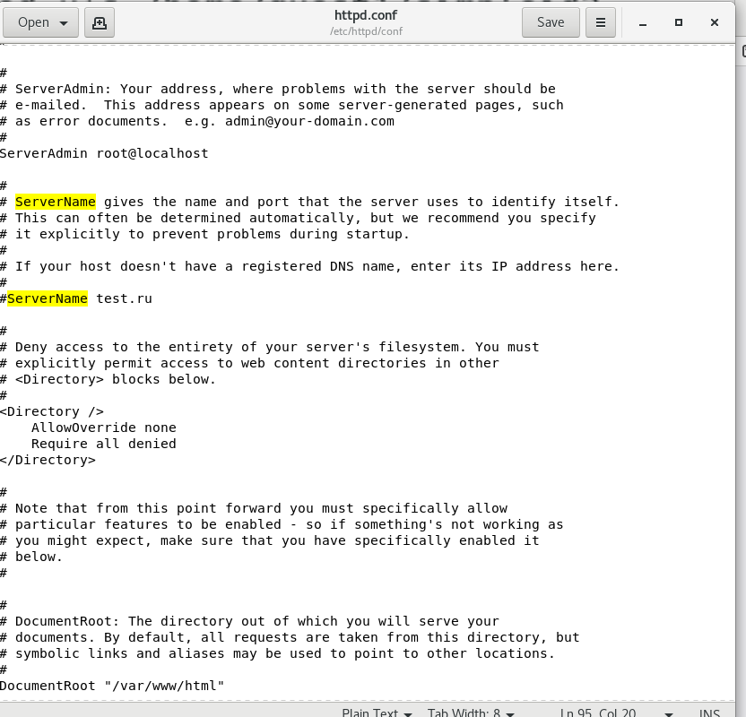{#fig:001 width=70%}

# Шаг 2

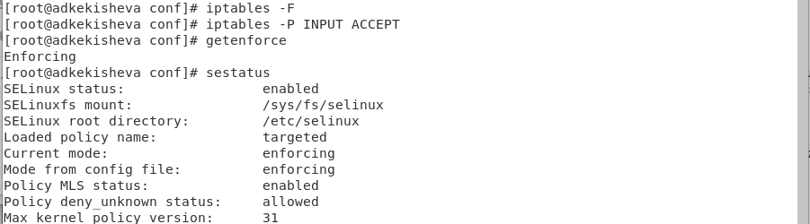{#fig:002 width=70%}

# Шаг 3

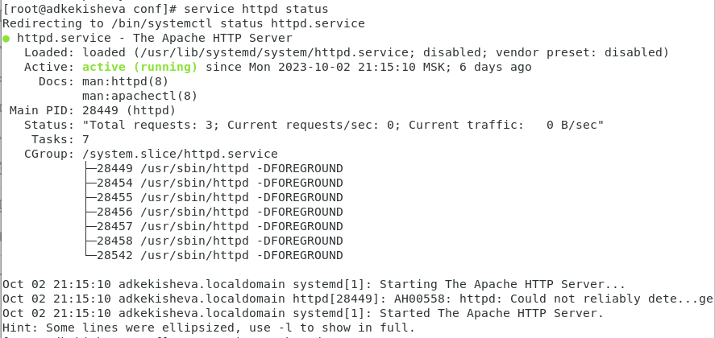{#fig:003 width=70%}

# Шаг 4

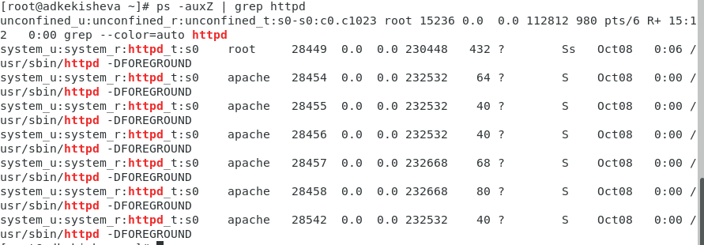{#fig:004 width=70%}
 
# Шаг 5

{#fig:005 width=70%}

# Шаг 6

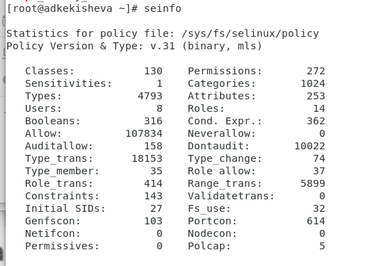{#fig:006 width=70%}

# Шаг 7

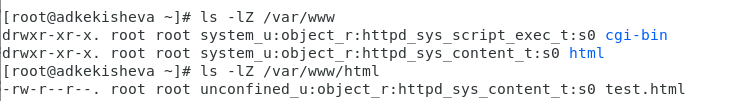{#fig:007 width=70%}

# Шаг 8

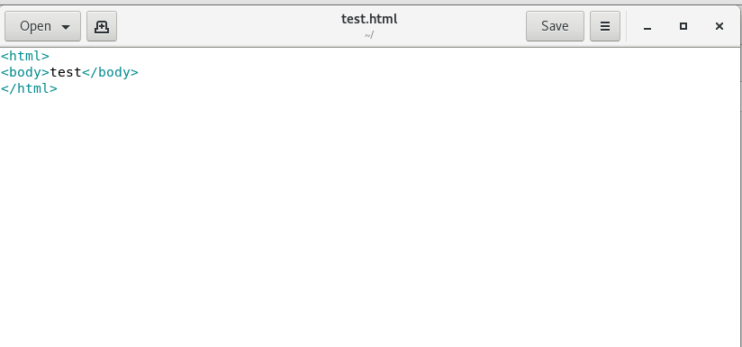{#fig:008 width=70%}

# Шаг 9

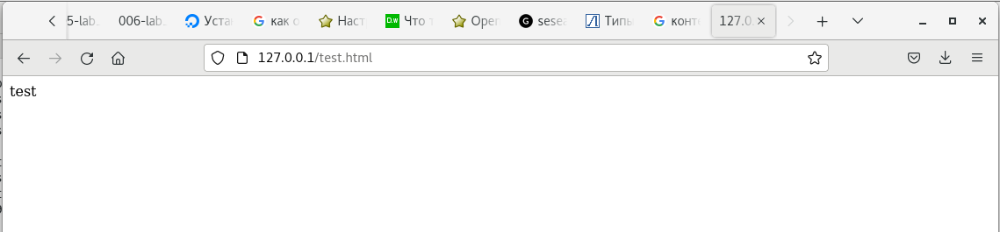{#fig:009 width=70%}

# Шаг 10

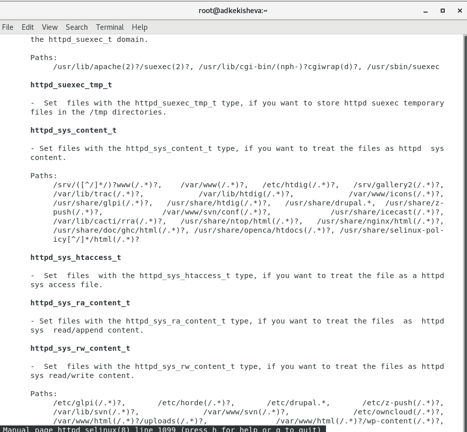{#fig:010 width=70%}

# Шаг 11

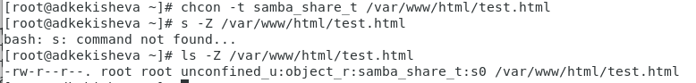{#fig:011 width=70%}

# Шаг 12

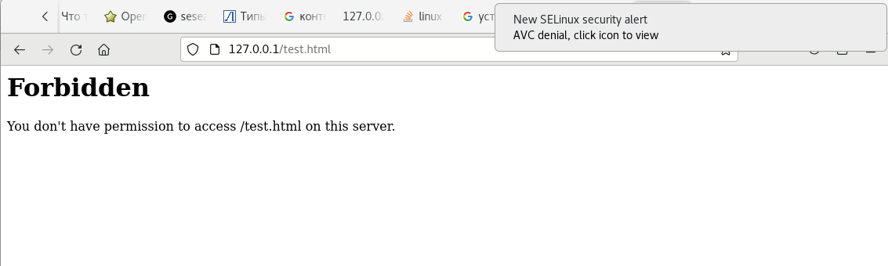{#fig:012 width=70%}

# Шаг 13

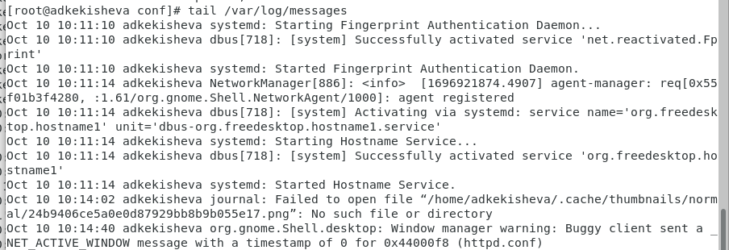{#fig:013 width=70%}

# Шаг 14

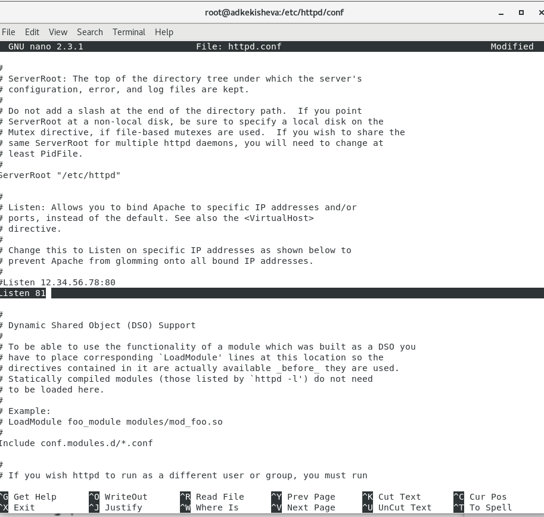{#fig:014 width=70%}

# Шаг 15

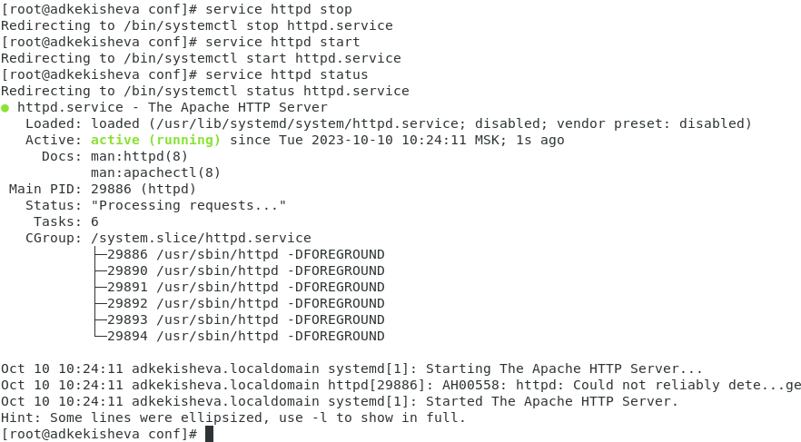{#fig:015 width=70%}

# Шаг 16

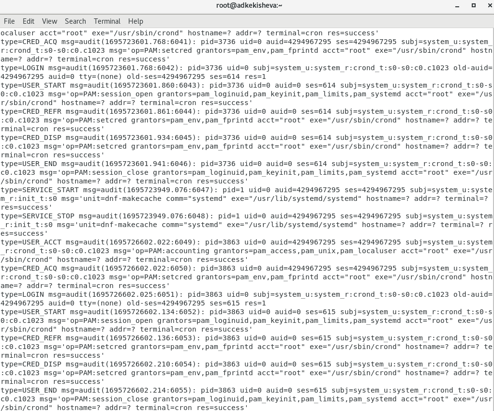{#fig:016 width=70%}

# Шаг 17

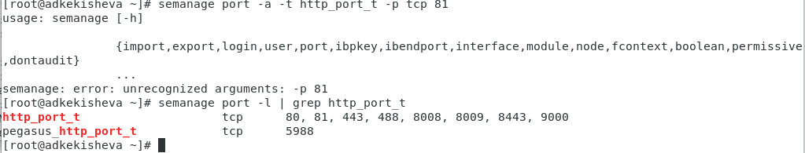{#fig:017 width=90%}

# Шаг 18

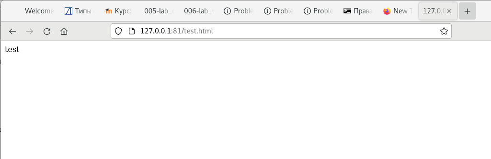{#fig:019 width=70%}

# Шаг 19

{#fig:019 width=70%}

# Шаг 20

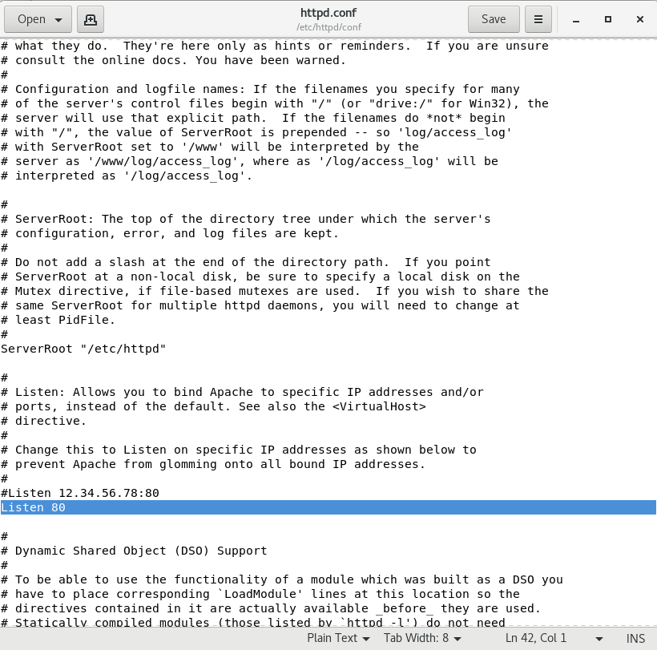{#fig:020 width=70%}

# Шаг 21

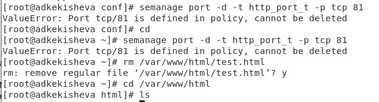{#fig:021 width=90%}

# Выводы

1. Развила навыки администрирования ОС Linux. 
2. Получила первое практическое знакомство с технологией SELinux1.
2. Проверила работу SELinx на практике совместно с веб-сервером Apache.

