---
## Front matter
title: "Лабораторная работа №6"
subtitle: "Мандатное разграничение прав в Linux"
author: "Кекишева Анастасия Дмитриевна"

## Generic otions
lang: ru-RU
toc-title: "Содержание"

## Bibliography
bibliography: bib/cite.bib
csl: pandoc/csl/gost-r-7-0-5-2008-numeric.csl

## Pdf output format
toc: true # Table of contents
toc-depth: 2
lof: true # List of figures
lot: true # List of tables
fontsize: 12pt
linestretch: 1.5
papersize: a4
documentclass: scrreprt
## I18n polyglossia
polyglossia-lang:
  name: russian
  options:
	- spelling=modern
	- babelshorthands=true
polyglossia-otherlangs:
  name: english
## I18n babel
babel-lang: russian
babel-otherlangs: english
## Fonts
mainfont: PT Serif
romanfont: PT Serif
sansfont: PT Sans
monofont: PT Mono
mainfontoptions: Ligatures=TeX
romanfontoptions: Ligatures=TeX
sansfontoptions: Ligatures=TeX,Scale=MatchLowercase
monofontoptions: Scale=MatchLowercase,Scale=0.9
## Biblatex
biblatex: true
biblio-style: "gost-numeric"
biblatexoptions:
  - parentracker=true
  - backend=biber
  - hyperref=auto
  - language=auto
  - autolang=other*
  - citestyle=gost-numeric
## Pandoc-crossref LaTeX customization
figureTitle: "Рис."
tableTitle: "Таблица"
listingTitle: "Листинг"
lofTitle: "Список иллюстраций"
lotTitle: "Список таблиц"
lolTitle: "Листинги"
## Misc options
indent: true
header-includes:
  - \usepackage{indentfirst}
  - \usepackage{float} # keep figures where there are in the text
  - \floatplacement{figure}{H} # keep figures where there are in the text
---

# Цель работы

1. Развить навыки администрирования ОС Linux. Получить первое практическое знакомство с технологией SELinux1.
2. Проверить работу SELinx на практике совместно с веб-сервером Apache.

# Задание

Описание задания и  рекомендованная последовательность выполнения работы, описана [@bib1]

# Теоретическое введение

Apache - популярный бесплатный opensource веб-сервер. Он является частью стека LAMP (Linux, Apache, MySQL, PHP), который обеспечивает большую часть Интернета [@bib2].
Логи Apache расположены тут:
- /var/log/httpd/ - расположение файлов логов Apache
- /var/log/httpd/access_log - показывает журнал систем, которые обращались к серверу
- /var/log/httpd/error_log - показывает список любых ошибок, с которыми сталкивается Apache

Контекст безопасности это набор всех атрибутов, связанных с объектами ипа файлов, каталогов, процессов, TCP сокетов и т.п. Контекст безопасности состоит из сущности, роли и домена или типа.
У процессов есть домен. Когда вы смотрите контекст безопасности процесса последнее поле -- это домен, например *user_passwd_t*.

Команда chcon позволяет изменить контекст, но он не работает на файловой системе /proc, т.к. она не поддерживает изменение меток.

Контекст безопасности файла, например, может варьироваться в зависимости от домена, который создал файл. По умолчанию, новый файл или каталог наследует тип от родительского каталога, однако вы можете задать иную политику [@bib3].

# Выполнение лабораторной работы

1. В конфигурационном файле /etc/httpd/httpd.conf необходимо задала параметр ServerName: ServerName test.ru (рис. @fig:001).    

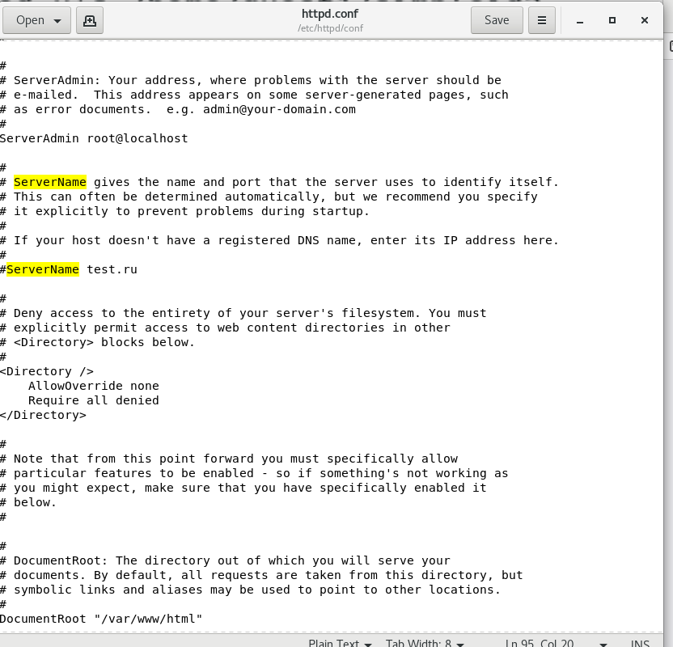{#fig:001 width=90%}

2. Проследила, чтобы пакетный фильтр был отключён или в своей рабочей конфигурации позволял подключаться к 80-у и 81-у портам протокола tcp. Отключить фильтр можно командами iptables -F и iptables -P INPUT ACCEPT (рис. @fig:002).    

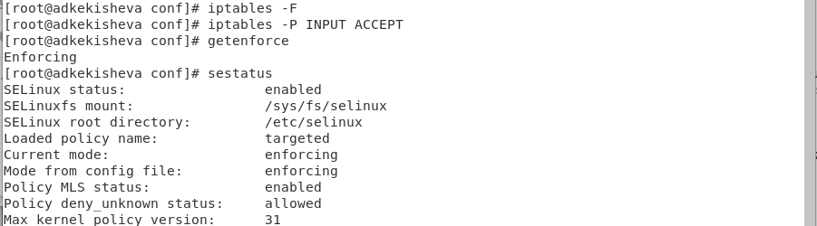{#fig:002 width=90%}

3. Вошла в систему с полученными учётными данными и убедилась, что SELinux работает в режиме enforcing политики targeted с помощью команд getenforce и sestatus (рис. @fig:002).    

4. Обратилась командой service httpd status с помощью браузера к веб-серверу, запущенному на моём компьютере, и убедилась, что всё работает (рис. @fig:003).    

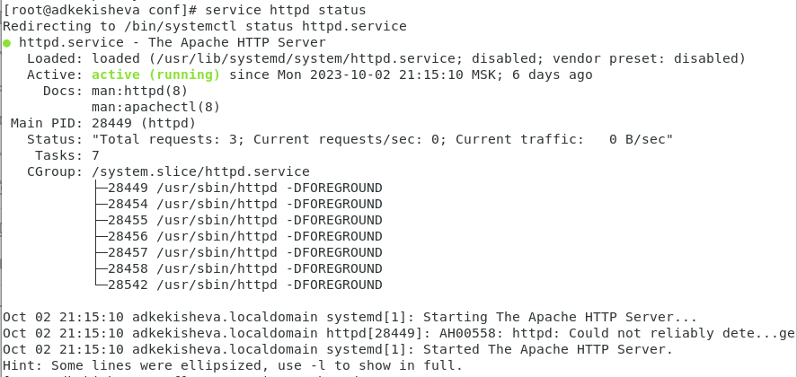{#fig:003 width=90%}

3. Командой ps -auxZ | grep httpd найшла веб-сервер Apache в списке процессов. Его контекст безопасности: httpd_t (рис. @fig:004).    

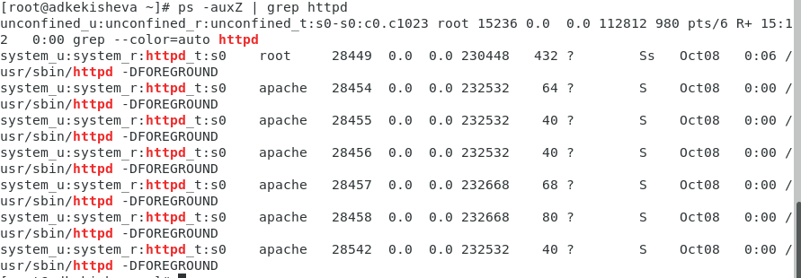{#fig:004 width=90%}
 
4. Посмотрела состояние переключателей SELinux для Apache с помощью sestatus -b | grep httpd.
Многие из состояний находятся в положении «off» (рис. @fig:005).    

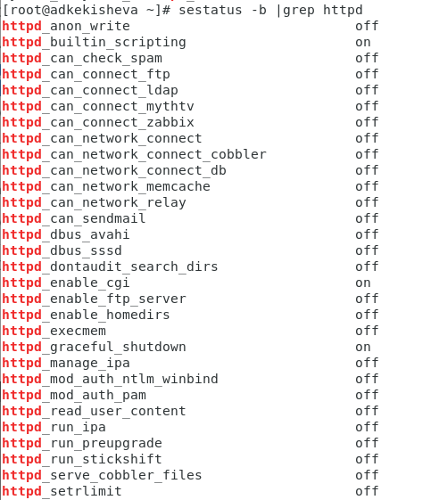{#fig:005 width=90%}

5. Посмотрела статистику по политике с помощью команды seinfo. Множество пользователей - 8, ролей - 14, типов- 4793 (рис. @fig:006).    

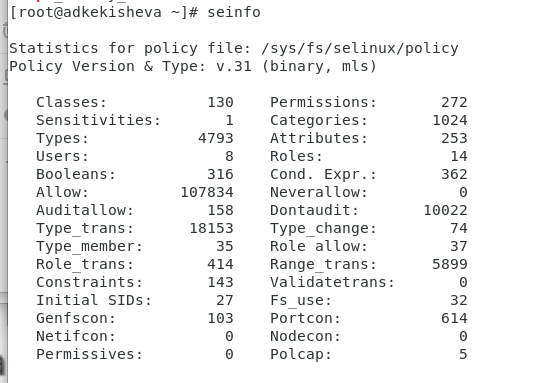{#fig:006 width=90%}

6. Определила типы файлов и поддиректорий, находящихся в директории /var/www, с помощью команды
ls -lZ /var/www (рис. @fig:007).    

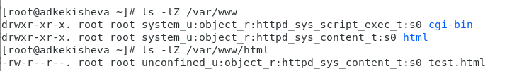{#fig:007 width=90%}

7. Определите тип файлов, находящихся в директории /var/www/html:
ls -lZ /var/www/html (рис. @fig:007).    

8. Определила круг пользователей, которым разрешено создание файлов в директории /var/www/html - можно владельцу файла.

9. Создайте от имени суперпользователя html-файл /var/www/html/test.html следующего содержания (рис. @fig:008):
> <html>
> <body>test</body>
> </html>

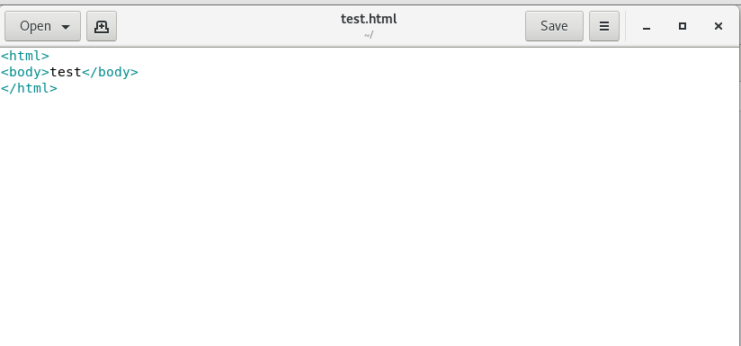{#fig:008 width=90%}

10. Проверила контекст созданного файла. Контекст, присваиваемый по умолчанию вновь созданным файлам в директории /var/www/html: httpd_sys_content_t (рис. @fig:007).    

11. Обратитесь к файлу через веб-сервер, введя в браузере адрес http://127.0.0.1/test.html. Убедилась, что файл был успешно отображён (рис. @fig:009).    

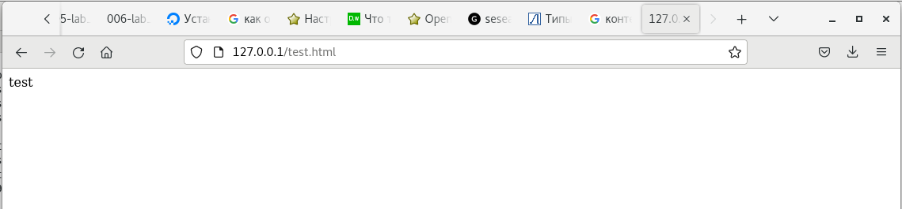{#fig:009 width=90%}

12. Изучила справку man httpd_selinux и выяснила, какие контексты файлов определены для httpd (рис. @fig:010).    

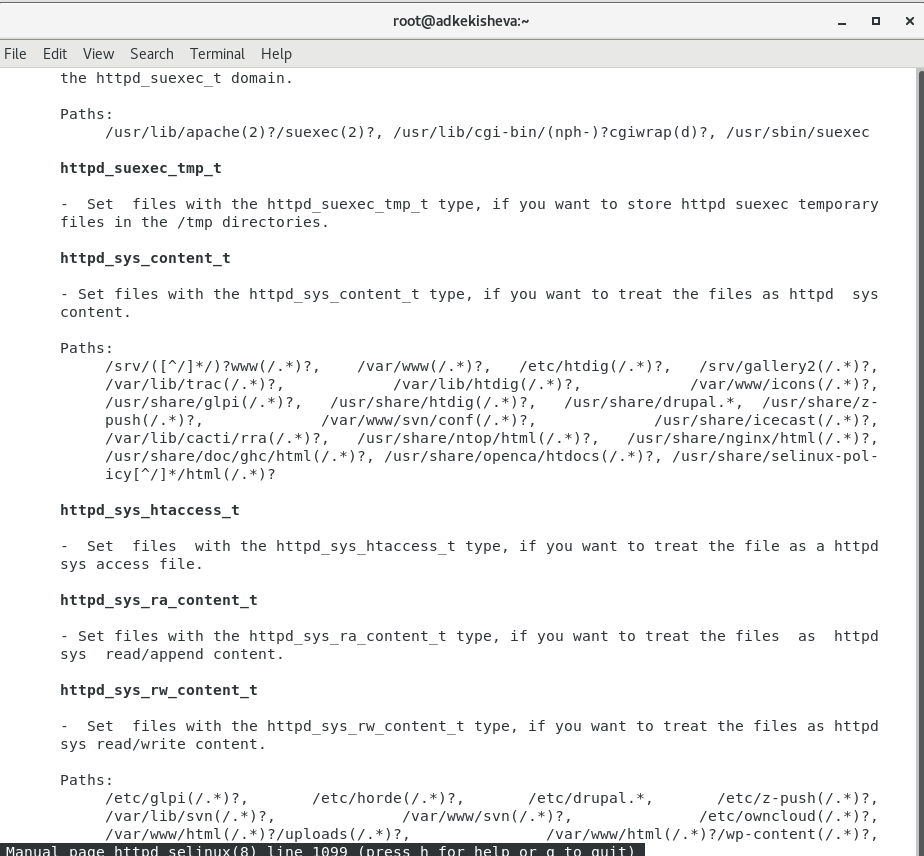{#fig:010 width=90%}

13. Изменила контекст файла /var/www/html/test.html с *httpd_sys_content_t* на любой другой, к которому процесс httpd не должен иметь доступа, например, на *samba_share_t*: chcon -t samba_share_t /var/www/html/test.html и проверила командой: ls -Z /var/www/html/test.html (рис. @fig:011).    

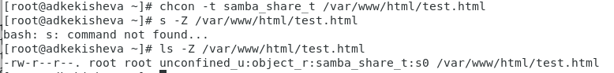{#fig:011 width=90%}

14. Попробуйте ещё раз получить доступ к файлу через веб-сервер, введя в браузере адрес http://127.0.0.1/test.html. Получила сообщение об ошибке. При изменении контекста http считает файл чужим. (рис. @fig:012).    

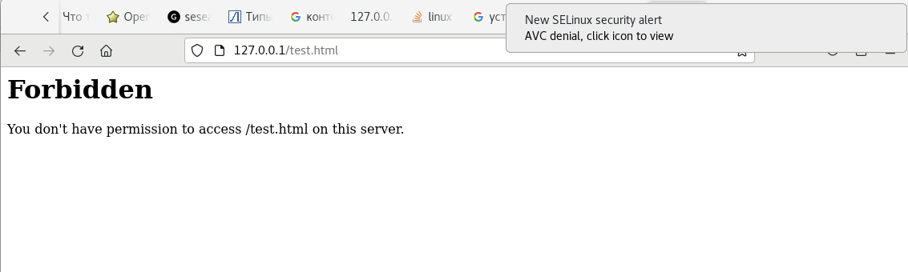{#fig:012 width=90%}

15. Просмотрела системный лог-файл: tail /var/log/messages и увидела ошибки, аналогичные указанным
выше, в файле /var/log/audit/audit.log (рис. @fig:013).    

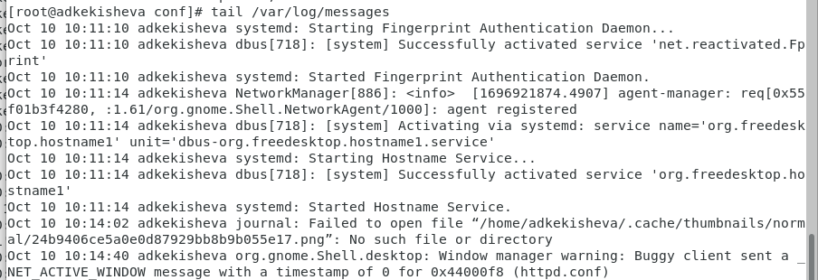{#fig:013 width=90%}

16. Попробуйте запустить веб-сервер Apache на прослушивание ТСР-порта 81 (а не 80, как рекомендует IANA и прописано в /etc/services). Для этого в файле /etc/httpd/httpd.conf нашла строчку Listen 80 и заменила её на Listen 81 (рис. @fig:014).    

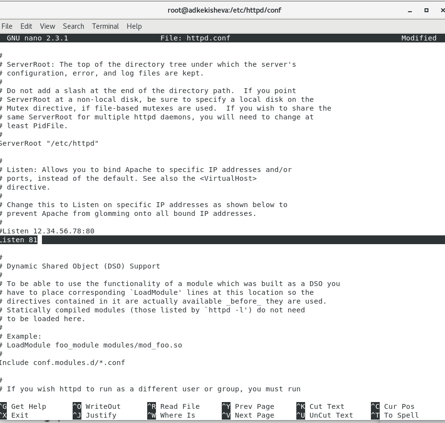{#fig:014 width=90%}

17. Выполните перезапуск веб-сервера Apache (рис. @fig:015).    

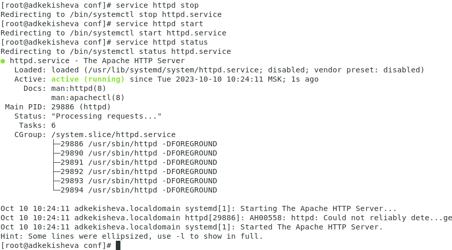{#fig:015 width=90%}

18. Проcмотрела лог-файлы: tail -nl /var/log/messages и файлы */var/log/http/error_log*, */var/log/http/access_log* и */var/log/audit/audit.log*, в последнием появились записи (рис. @fig:016).    

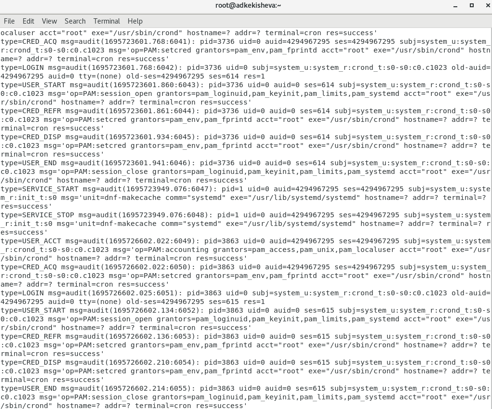{#fig:016 width=90%}

19. Выполнила команду *semanage port -a -t http_port_t -р tcp 81*
После проверила список портов командой semanage port -l | grep http_port_t
Убедилась, что порт 81 появился в списке (рис. @fig:017).    

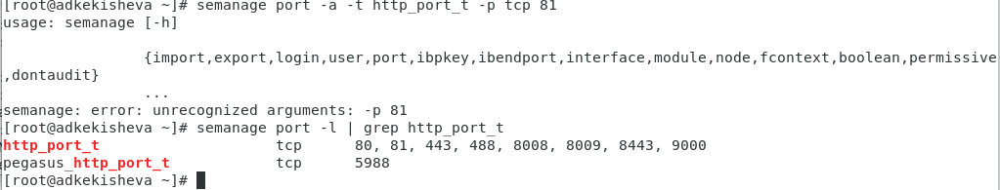{#fig:017 width=90%}

20. Перезапустила веб-сервер Apache ещё раз. Он сейчас запустился, так как мы добавили порт. Вернула контекст *httpd_sys_cоntent__t* к файлу /var/www/html/test.html: *chcon -t httpd_sys_content_t /var/www/html/test.html* (рис. @fig:018).    

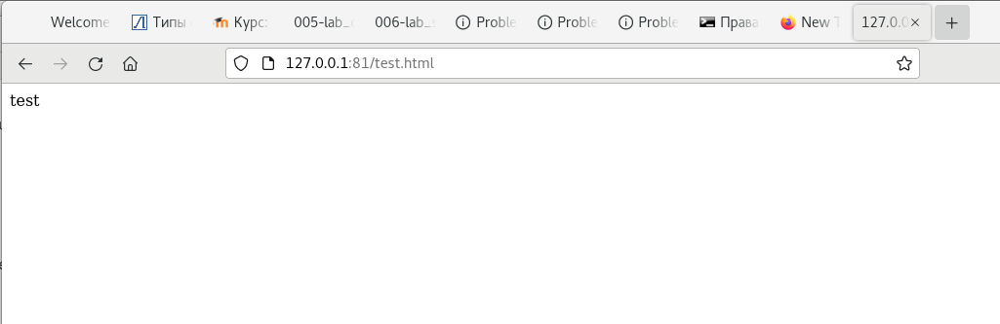{#fig:019 width=90%}

21. После этого попробовала получить доступ к файлу через веб-сервер, введя в браузере адрес http://127.0.0.1:81/test.html. Увидела содержимое — слово «test» (рис. @fig:019).    

{#fig:019 width=90%}

22. Исправила обратно конфигурационный файл apache, вернув Listen 80 (рис. @fig:020).    

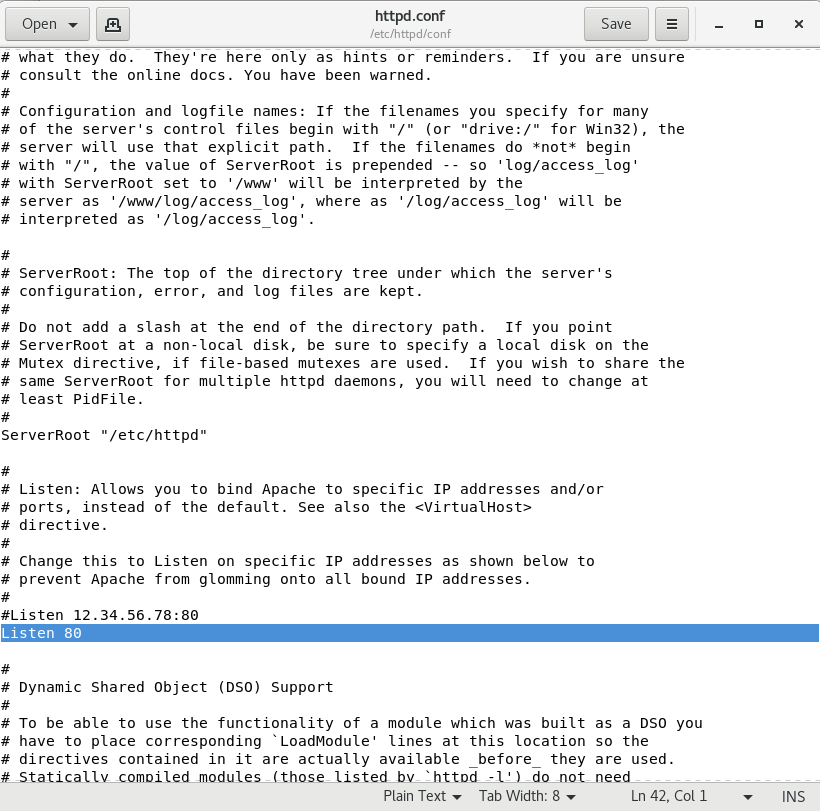{#fig:020 width=90%}

23. Удалила привязку *http_port_t* к 81 порту: *semanage port -d -t http_port_t -p tcp 81* - это оказалось запрещено (рис. @fig:021).    

24. Удалите файл /var/www/html/test.html: rm /var/www/html/test.html (рис. @fig:021).    

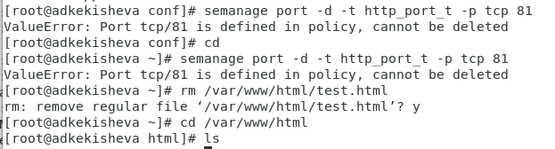{#fig:021 width=90%}

# Выводы

1. Развила навыки администрирования ОС Linux. 
2. Получила первое практическое знакомство с технологией SELinux1.
2. Проверила работу SELinx на практике совместно с веб-сервером Apache.

# Список литературы{.unnumbered}

::: {#refs}
:::
