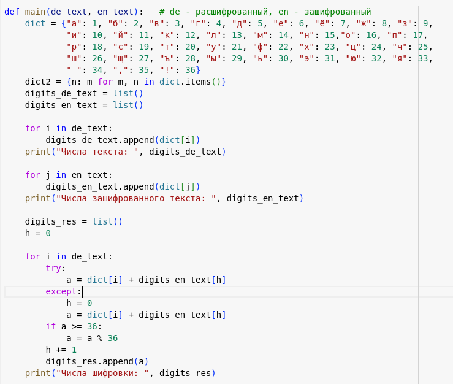
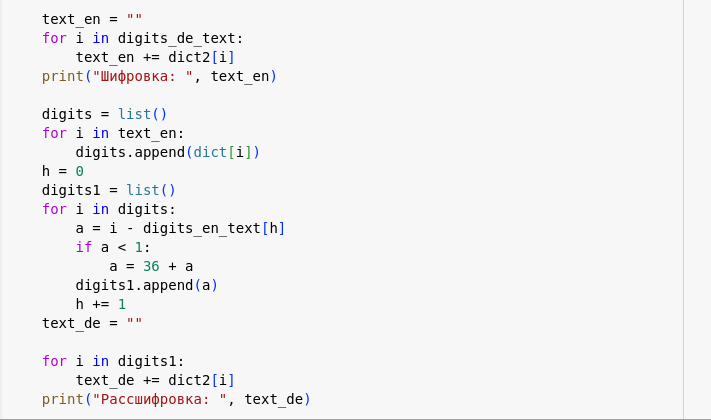
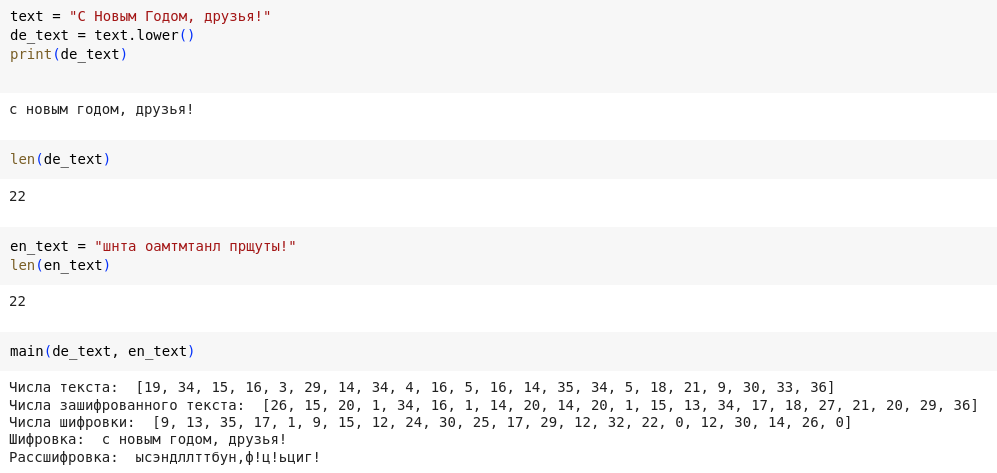

---
## Front matter
lang: ru-RU
title: Лабораторная работа №7
subtitle: Элементы криптографии. Однократное гаммирование
author:
  - Кекишева А.Д.
institute:
  - Российский университет дружбы народов, Москва, Россия
date: 16 октября 2023

## i18n babel
babel-lang: russian
babel-otherlangs: english

## Formatting pdf
toc: false
toc-title: Содержание
slide_level: 2
aspectratio: 169
section-titles: true
theme: metropolis
header-includes:
 - \metroset{progressbar=frametitle,sectionpage=progressbar,numbering=fraction}
 - '\makeatletter'
 - '\beamer@ignorenonframefalse'
 - '\makeatother'
---

# Информация

## Докладчик

:::::::::::::: {.columns align=center}
::: {.column width="70%"}

  * Кекишева Анастасия Дмитриевна
  * Бизнес-информатика
  * Кафедра теории веротности и кибербезопасности
  * Российский университет дружбы народов
  * 1032201194@pfur.ru
  * <https://github.com/adkekisheva>
:::
::: {.column width="30%"}
:::
::::::::::::::

# Цель работы

Освоить на практике применение режима однократного гаммирования.

# Задание

Нужно подобрать ключ, чтобы получить сообщение «С Новым Годом, друзья!». Требуется разработать приложение, позволяющее шифровать и дешифровать данные в режиме однократного гаммирования. Приложение должно:
1. Определить вид шифротекста при известном ключе и известном открытом тексте.
2. Определить ключ, с помощью которого шифротекст может быть преобразован в некоторый фрагмент текста, представляющий собой один из возможных вариантов прочтения открытого текста.

# Выполнение лабораторной работы

# Шаг 1

{#fig:001 width=70%}

# Шаг 2

{#fig:002 width=70%}

# Шаг 3

{#fig:003 width=70%}

# Выводы

Освоила на практике применение режима однократного гаммирования, написав программу, которая определяет вид шифротекста при известном ключе и известном открытом тексте и определяет ключ.

