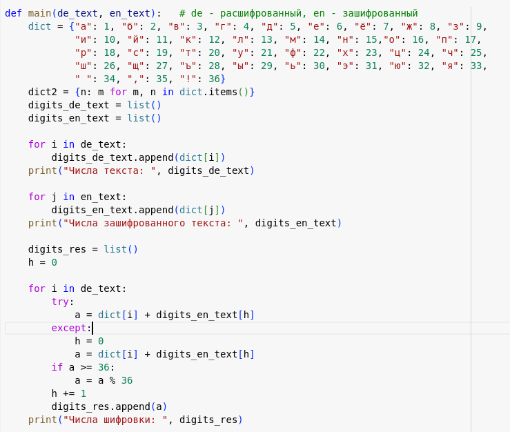

---
## Front matter
title: "Лабораторная работа №7"
subtitle: "Элементы криптографии. Однократное гаммирование"
author: "Кекишева Анастасия Дмитриевна"

## Generic otions
lang: ru-RU
toc-title: "Содержание"

## Bibliography
bibliography: bib/cite.bib
csl: pandoc/csl/gost-r-7-0-5-2008-numeric.csl

## Pdf output format
toc: true # Table of contents
toc-depth: 2
lof: true # List of figures
lot: true # List of tables
fontsize: 12pt
linestretch: 1.5
papersize: a4
documentclass: scrreprt
## I18n polyglossia
polyglossia-lang:
  name: russian
  options:
	- spelling=modern
	- babelshorthands=true
polyglossia-otherlangs:
  name: english
## I18n babel
babel-lang: russian
babel-otherlangs: english
## Fonts
mainfont: PT Serif
romanfont: PT Serif
sansfont: PT Sans
monofont: PT Mono
mainfontoptions: Ligatures=TeX
romanfontoptions: Ligatures=TeX
sansfontoptions: Ligatures=TeX,Scale=MatchLowercase
monofontoptions: Scale=MatchLowercase,Scale=0.9
## Biblatex
biblatex: true
biblio-style: "gost-numeric"
biblatexoptions:
  - parentracker=true
  - backend=biber
  - hyperref=auto
  - language=auto
  - autolang=other*
  - citestyle=gost-numeric
## Pandoc-crossref LaTeX customization
figureTitle: "Рис."
tableTitle: "Таблица"
listingTitle: "Листинг"
lofTitle: "Список иллюстраций"
lotTitle: "Список таблиц"
lolTitle: "Листинги"
## Misc options
indent: true
header-includes:
  - \usepackage{indentfirst}
  - \usepackage{float} # keep figures where there are in the text
  - \floatplacement{figure}{H} # keep figures where there are in the text
---

# Цель работы

Освоить на практике применение режима однократного гаммирования.

# Задание

Нужно подобрать ключ, чтобы получить сообщение «С Новым Годом, друзья!». Требуется разработать приложение, позволяющее шифровать и дешифровать данные в режиме однократного гаммирования. Приложение должно:
1. Определить вид шифротекста при известном ключе и известном открытом тексте.
2. Определить ключ, с помощью которого шифротекст может быть преобразован в некоторый фрагмент текста, представляющий собой один из возможных вариантов прочтения открытого текста.

# Теоретическое введение

Гаммирование, или Шифр XOR, — метод симметричного шифрования, заключающийся в «наложении» последовательности, состоящей из случайных чисел, на открытый текст. Последовательность случайных чисел называется гамма-последовательностью и используется для зашифровывания и расшифровывания данных. Суммирование обычно выполняется в каком-либо конечном поле [@bib1].

В соответствии с теорией криптоанализа, если в методе шифрования используется однократная вероятностная гамма (однократное гаммирование)той же длины, что и подлежащий сокрытию текст, то текст нельзя раскрыть.
Даже при раскрытии части последовательности гаммы нельзя получить информацию о всём скрываемом тексте.

Наложение гаммы по сути представляет собой выполнение операции сложения по модулю 2 (XOR) (обозначаемая знаком \bigoplus) между элементами гаммы и элементами подлежащего сокрытию текста. Такой метод шифрования является симметричным, так как двойное прибавление одной и той же величины по модулю 2 восстанавливает исходное значение, а шифрование и расшифрование выполняется одной и той же программой.

Если известны ключ и открытый текст, то задача нахождения шифротекста заключается в применении к каждому символу открытого текста следующего правила: 
> Ci = Pi \bigoplus Ki,

где Ci — i-й символ получившегося зашифрованного послания, Pi — i-й cимвол открытого текста, Ki — i-й символ ключа, i = 1, m. Размерности открытого текста и ключа должны совпадать, и полученный шифротекст будет такой же длины.

Если известны шифротекст и открытый текст, то задача нахождения ключа решается через формулу, а именно, обе части равенства необходимо сложить по модулю 2 с Pi:
> Ci \bigoplus Pi = Pi \bigoplus Ki \bigoplus Pi = Ki,
> Ki = Ci \bigoplus Pi.

Открытый текст имеет символьный вид, а ключ — шестнадцатеричное представление. Ключ также можно представить в символьном виде, воспользовавшись таблицей ASCII-кодов [@bib2].

# Выполнение лабораторной работы

1. Написала код (рис. @fig:001, @fig:002), который определяет вид шифротекста при известном ключе и известном открытом тексте, а также определяет ключ.

{#fig:001 width=80%}

{#fig:002 width=80%}

Мой код преобразет текст, написанный в нижнем регистре, поэтому первоначальную фразу я сделала таковой, командой lower(). Далее проверила, чтобы текст для шифровки также состоял из такого же количества символов и запустила программу. Результат: ысэндллттбун,ф!ц!ьциг!

{#fig:003 width=90%}

# Выводы

Освоила на практике применение режима однократного гаммирования, написав программу, которая определяет вид шифротекста при известном ключе и известном открытом тексте и определяет ключ.

# Список литературы{.unnumbered}

::: {#refs}
:::
